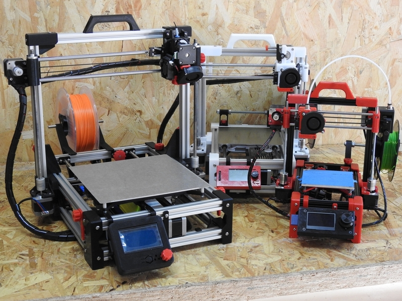

# What's that?

**Scalable Foldarap** is a modified version of Foldarap v.1.0 3D printer originally made by [EnmanuelG](https://github.com/EmmanuelG/Foldarap). 

Modification is, basically, an addon to use a ___direct drive extruder___. Also it is able to fold keeping the display in its position. You can also choose to use ___smooth rods___ or ___linear guides___ for X and Y axis. And finally, it is included the ability to build ___different printer sizes___ just changing the profile lenght. STL and STEP files are supplied in order to make your own custom adjustements.

Thankx to...

* [EnmanuelG/OpenEdge](https://github.com/OpenEdge), foldarap design.
* [rowokii](https://www.thingiverse.com/thing:767317), parametric universal spool holder.
* [judetomate](https://www.thingiverse.com/thing:47752), spool holder idea.
* [Campy3D](https://www.thingiverse.com/thing:2915718), LCD MKS Mini 12864 Mount Enclosure Box.
* [bipsen](http://www.thingiverse.com/thing:3558349), Case/holder for Fysetc Mini 12864 Display.

...for their respective works, and to [Clone Wars](https://www.reprap.org/wiki/Proyecto_Clone_Wars) comunity and [3DPrinter Party](http://www.3dprinterparty.es/) people for their support.

Latest stable version is 2.5. Spanish documentation is on the way.

For the latest news about this development, don't hesitate to contact us on our [Telegram group](https://t.me/scalable_foldarap).

enjoy!!