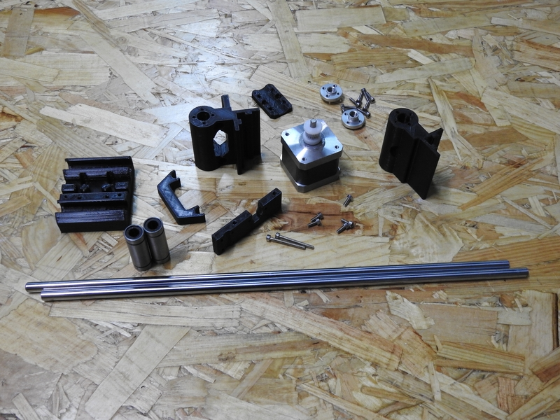
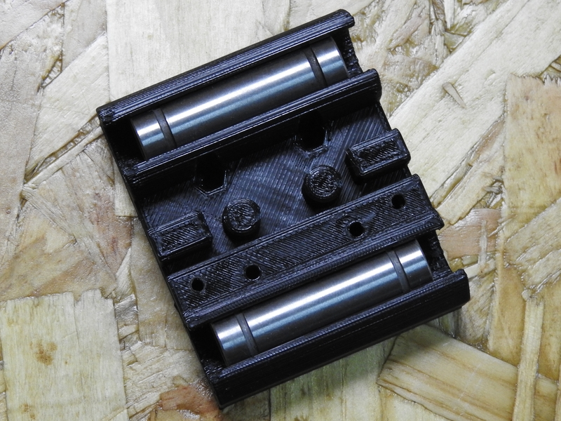
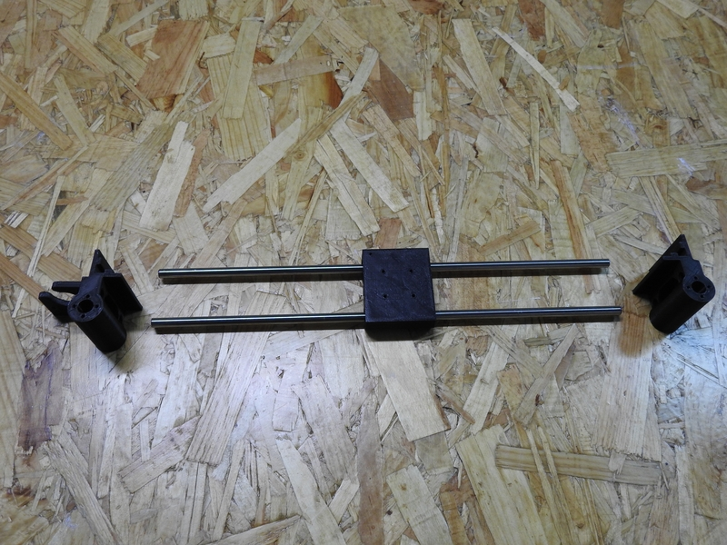
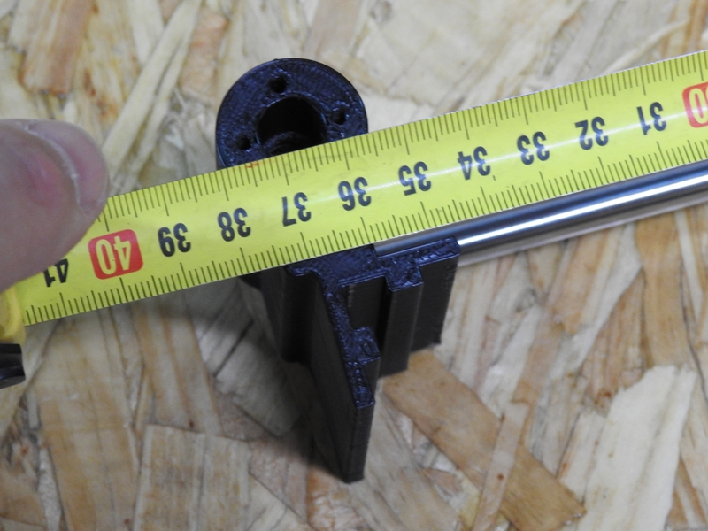
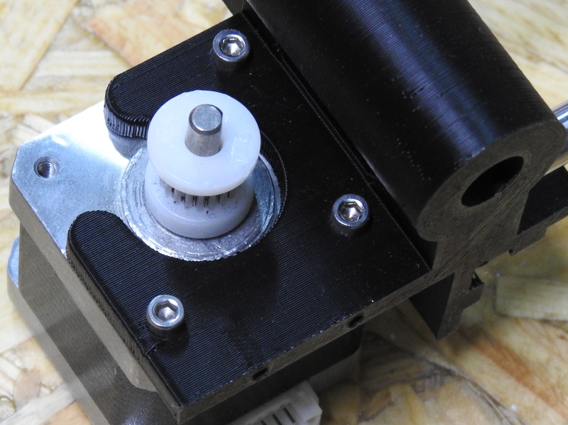
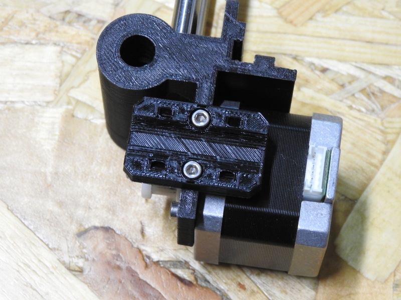
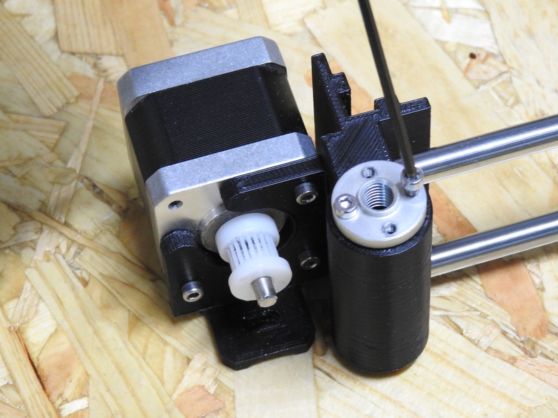
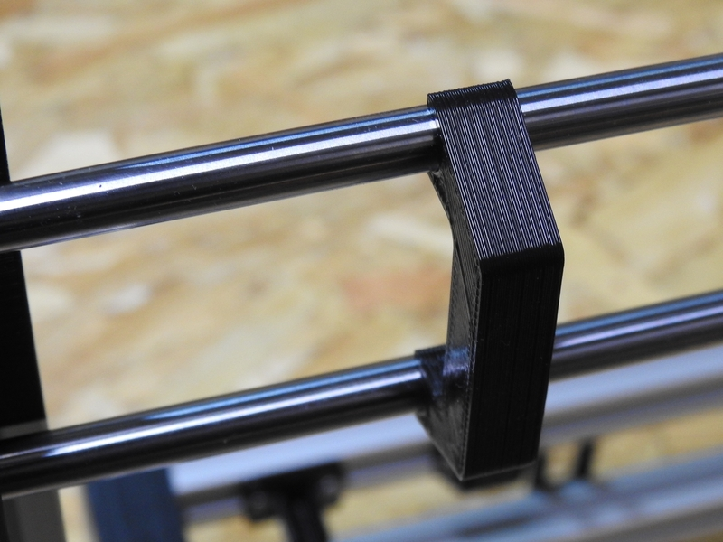
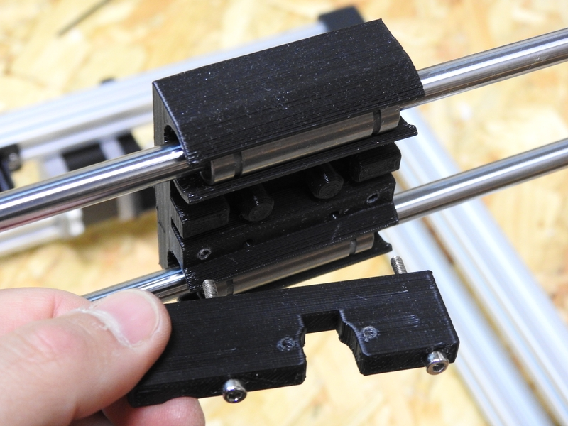

## ENSAMBLADO DEL EJE X

### Material
Para el ensamblado de eje X necesitaremos los siguientes materiales:

- 1 x Juego de piezas imprimibles para el Eje X (ver Indice de piezas)
- 2 x barra lisa de 8mm ó 6mm (según modelo de impresora a montar)
- 4 x rodamientos lineales LM8UU ó LM6UU 8 (según modelo a montar)
- 1 x motor paso a paso (según modelo a montar)
- 2 x varillas roscadas de tipo TR8 ó M5 (según modelo a montar)
- 4 x tornillos allen M3 de 8mm
- 2 x tornillos allen M3 de 30mm/40mm (sólo para la Super Foldarap)
- 2 x tornillos allen M3 de 20mm (sólo para Foldarap y Mini Foldarap)

---

### Proceso

El proceso de montaje del Eje X es muy simple y rápido de ejecutar. En primer lugar, colocaremos los rodamientos lineales en el carro.

Con el carro listo, el punto de partida para el montaje es el que se muestra en la figura siguiente.

Limpia los agujeros donde van encajadas las barras lisas antes de insertarlas. Así será más fácil encajarlas.

Comprobaremos la distancia que debe haber entre la pieza del portamotor y el contrapunto. Para la Super Foldarap la distancia debe ser de 36cm. En la Foldarap serán 26,5cm y en la Mini Foldarap 18cm.

Por último, montaremos a ambos lados las tuercas que elevarán el Eje X a lo largo del Eje Z. También colocaremos el tope del final de carrera y el portacables.

