En este apartado se mostrarán únicamente los pasos a seguir para instalar la tarjeta de control de la impresora. La configuración y calibración de la misma se dejan para un apartado posterior.
  
Puesto que cada usuario utilizará la tarjeta de control que más le guste o pueda tener disponible, los pasos a seguir serán lo más genéricos posible para que puedan extrapolarse a cualquier tarjeta. 

**Paso 1 - Seleccionar el tipo de tarjeta:** Para un proyecto como este es más que suficiente utilizar una tarjeta de _8 bits_. Hay que tener en cuenta que una máquina cartesiana, como es la Foldarap, no necesita hacer muchos cálculos para los posicionamientos, ya que su cinemática (la forma en que realiza los movimientos) es la más simple de todas. No obstante, es perfectamente posible utilizar una tarjeta de _32 bits_, especialmente si se tiene pensado usar una _pantalla táctil TFT_. En este sentido, la **SKR v.1.3** podría ser una buena candidata, todo dependerá de tu presupuesto.

Si optamos por los 8 bits, para un iniciado, se puede recomendar un clásico como es **Arduino+RAMPS**. Es casi un estandar de facto que ha sido muy probado y que funciona con cualquier tipo de software. En los modelos de prueba que se han montado, se ha utilizado una [KFB 2.0](https://www.biqu.equipment/products/3d-mother-board-kfb3-0-12v-update-kfb2-0-suitable-for-a4988-and-lcd-2004) (Superfolda), una [Rumba](https://www.reprap.org/wiki/RUMBA) (Foldarap DDE) y una [OVM20Lite](https://www.staticboards.es/productos/ovm20-lite/) (Minifolda). Todos estos modelos son una combinación de Arduino+RAMPS en una sola tarjeta. Hay muchas más en el mercado y a precios muy asequibles. Elegir una u otra dependerá, de nuevo, de tu presupuesto.

Una característica de **debería tener** a estas alturas una tarjeta de control es la posibilidad de alimentarla a 24v. Los nuevos modelos vienen casi todos con este tipo de característica, sin embargo, el clásico Arduino+RAMPS no siempre viene preparado para ello. Y la OVM20Lite usada en el modelo Mini Foldarap de prueba tampoco. 

Otra característica más de la tarjeta a tener en cuenta es la posibilidad de **cambiar un driver** si se quema. La mayor parte de las tarjetas del mercado actual permiten esto, aunque hay algunos modelos, especialmente los de pequeño formato, que los integran en la misma tarjeta, imposibilitando su sustitución en caso de problemas, con todo lo que ello significa. Así que, ¡¡mucho cuidado con la tarjeta de control!!.

**Paso 2: Seleccionar los módulos para los motores:** Los módulos de los motores o ***drivers*** son etapas de potencia que se intercalan entre la placa de control y el motor y sirven, principalmente, para controlar la velocidad y sentido de giro de los mismos. Permiten un control muy preciso de los movimientos de la impresora y algunos de ellos, evitan incluso un funcionamiento ruidoso. Si te has decantado por una tarjeta de control con módulos integrados, no tienes nada que hacer en este punto, pues el fabricante ya _"ha decidido por ti"_ el tipo de drivers que vas a usar. Así que no es necesario que sigas leyendo este apartado.

Los clásicos son los **A4988**, muy baratos, ampliamente disponibles y efectivos, pero bastante ruidosos. Los **DRV8825** son un poco más precisos, pero igual de ruidosos. Los últimos en llegar han sido los **TMC2xxx**, tanto en su versión 2130 como los 2208 (la última versión es la 2209). Silenciosos y precisos, aunque más caros que los anteriores y necesitan configuración especial y ventilación activa si se quiere sacar el máximo partido de ellos. Pero no son los únicos, ya que además de ellos encontramos otros como los **L6470**, los **LV8729**, los **TB6560** o los **TB6600**, por mencionar sólo unos pocos.

Si quieres profundizar un poco más en el tema de drivers, puedes empezar por esta [guía en español de Staticboards](https://www.staticboards.es/blog/drv8825-vs-a4988/). Si bien sólo trata de los drivers A4988 y DRV8825, es un muy buen punto de partida para ir tirando del hilo. En Internet existen mucha más información. No dejes de echar mano de ella siempre que lo necesites.

**Paso 3: Seleccionar fusor (y extrusor):** En este punto la mejor opción sería ir a lo seguro desde el principio. En ese sentido el fusor de fusores es el **E3D**, ya sea en su versión **V6** habitual o en su versión **V6 Lite**. Es uno de los más fiables, y está disponible tanto en su versión original (recomendada), como en cualquiera de sus imitaciones, si bien la calidad de éstas últimas puede ser muy variable.

En cuanto al extrusor, o parte (fría) que empuja el filamento hacia el fusor (parte caliente), la mejor opción es el **extrusor directo**, tanto si se emplea con reductora como sin ella. El extrusor con reductora más imitado es, sin duda, el **BMG Bondtech**, tan fiable y preciso como caro. Sus imitaciones no son tan cuidadas en acabados y calidad, pero pueden aliviar el gasto económico. Como extrusor directo sin reductora figura el **Mk8** y versiones posteriores. Es bastante fiable y robusto, con una calidad de extrusión bastante buena.

Hay una tercera opción que es emplear un **extrusor con hilo encamisado (tipo bowden)**. El extrusor puede ser de cualquiera de los dos tipos anteriores. El fusor deberá estar preparado para el trabajo con tubo de teflón, por lo que será preciso fijarse en este detalle a la hora de adquirirlo.

**Paso 4: Selecconar los cables y conectores:** La respuesta rápida para este punto es usar los cables y conectores que vengan con los motores, finales de carrera, fusor, cama caliente, etc... ¿La razón? pues que ya está calculados para el trabajo que van a realizar. También tienen los conectores engastados, por lo que no se necesita perder el tiempo preparándolos.

Si a pesar de esto quieres lanzarte y _"hacerlos tu mismo"_, en el enlace siguiente se describe con todo detalle lo que tendrás que tener en cuenta:

[Tom's Guide: How to wire your 3D printer](https://toms3d.org/2016/07/20/how-to-wire-your-3d-printer/) (está en inglés).

Aclarados todos los puntos clave referentes al apartado de la electrónica, vamos con el cableado de la misma.

---
###Cableado de la Electrónica
---

Antes de empezar a montar la electrónica de la impresora, conviene imprimir algunos soportes para la tarjeta de control. Estos soportes llevan el nombre de ___board-holder-x2___. El número de ellos dependerá del lugar de la impresora donde quieras fijarla. Si los agujeros de sujección no encajasen con los de tu tarjeta, modifica la pieza del fichero fuente ___y-board-holder.FCStd___ que se encuentra en la carpeta _/freecad/misc_. También puedes usar uno diseñado a medida por ti. En la secuencia de imágenes se muestra el proceso de montaje de la tarjeta _Rumba_ en la Foldarap DDE.

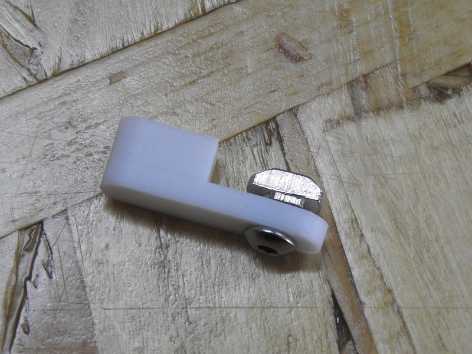

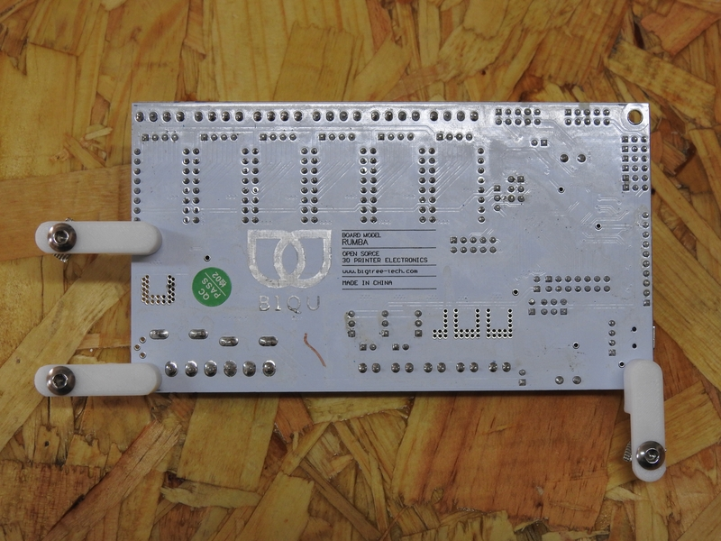

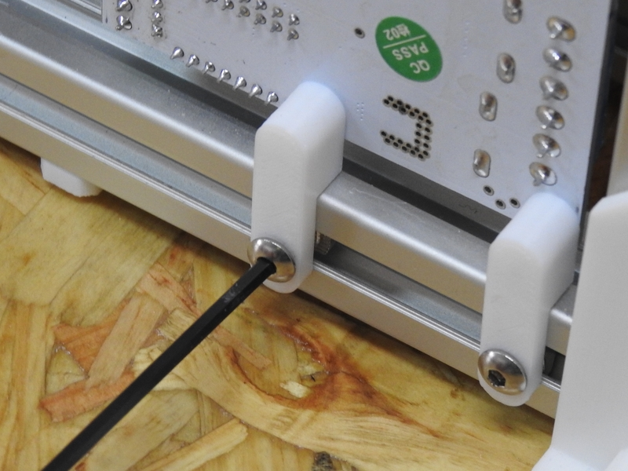

Con la tarjeta en su sitio, es momento para cablearla desde la fuente de alimentación. En esta ocasión comprobaremos la polaridad de las canexiones. Los signos **V+** y **V-** que se ven grabados en la fuente de alimentación corresponden al positivo y negativo de la fuente. 

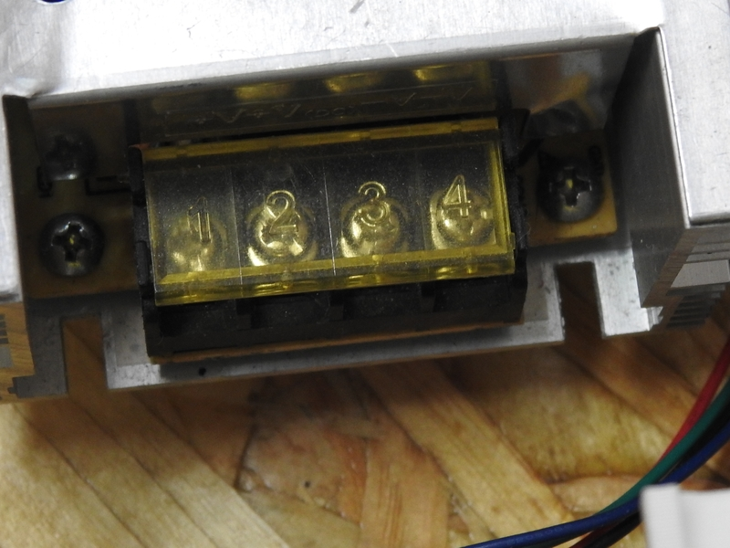

Como en casos anteriores, se recomienda utilizar conectores _faston de horquilla_ para conectar los cables en la fuente de alimentación. Si no se dispone de ellos, se pueden conectar los cables directamente.

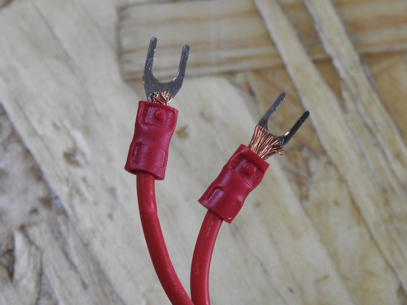

En el caso de las puntas de conexión del cable a la tarjeta, se pueden emplear _punteras_ para evitar que el cable se deshilache. Si no hay punteras a mano, se puede dar un punto de estaño en el extremo de los cables desnudos. Cuando se conecten los cables en la regleta, el tornillo los aplastará y sujetará firmemente, mejorando la transferencia de corriente del cable a la pista de cobre de la tarjeta.

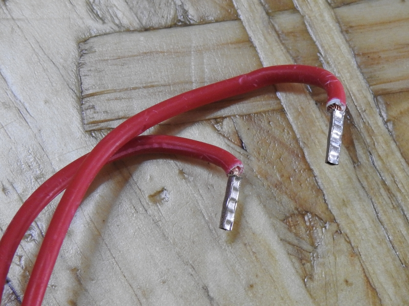

Aprieta bien los tornillos de los conectores de la fuente de alimentación. Si quedasen flojos pueden ser un peligro, ya que se puede generar un ___punto caliente___ en la conexión que acabe fundiendo el terminal con el peligro consecuente.

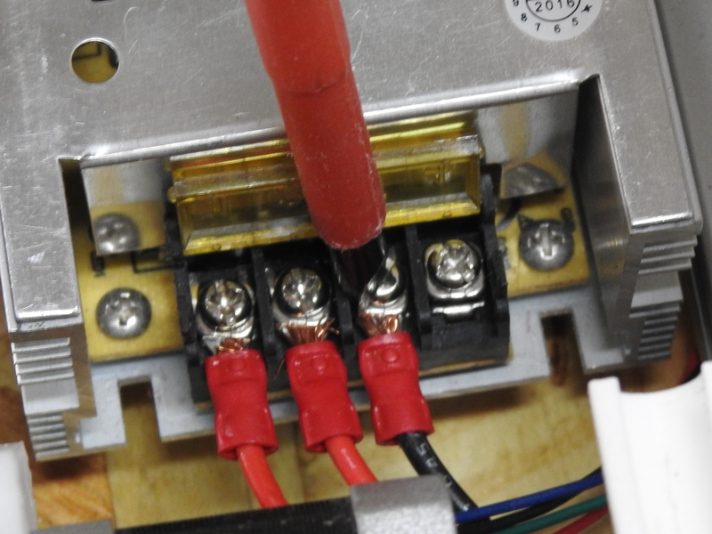

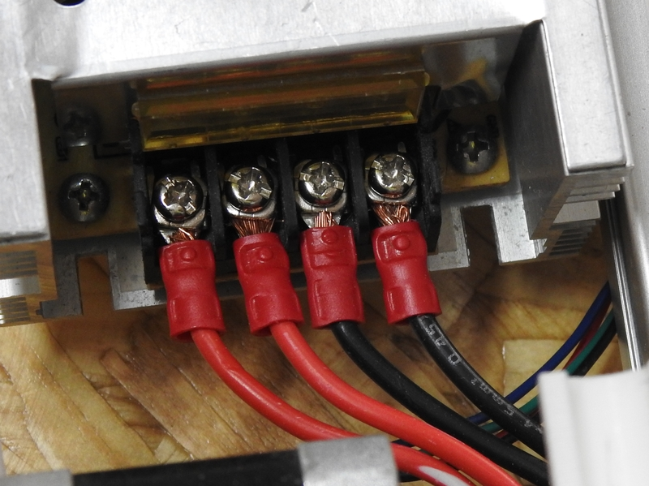

Repite el proceso en la tarjeta de control. Fíjate muy bien cómo están marcados los terminales **+** y **-** en la tarjeta para conectar los cables con la polaridad adecuada, de lo contrario, **¡¡¡quemarás la tarjeta!!!**. Se recomienda, por tanto, consultar siempre y ante cualquier duda, el esquema de la tarjeta que se esté usando.

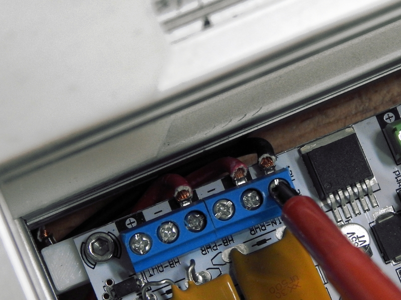

En esta ocasión no te excedas apretando, los terminales de la tarjeta **no son tan resistentes** como los de la fuente (especialmente los de tarjetas de bajo coste) y podrías romperlos si aprietas demasiado.

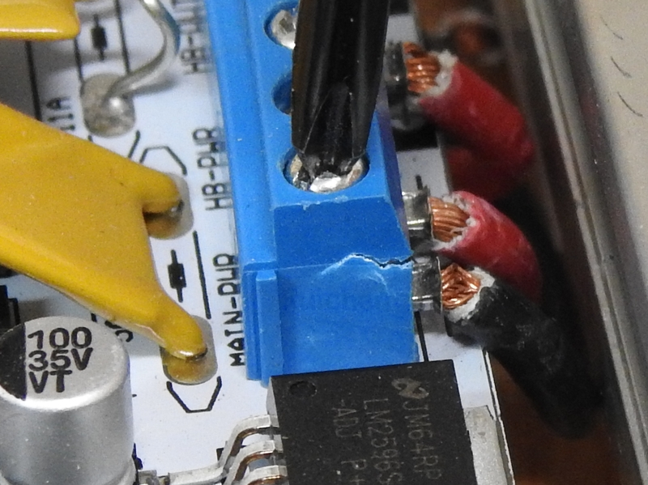

Ahora le toca el turno a los cables que vienen del fusor. Estos cables son numerosos, por lo que puedes ayudarte de una **funda mallada** o **helicoidal** para mantener el mazo compactado. En la imagen se ha usado una malla helicoidal de polímero adquirida en un bazar local.

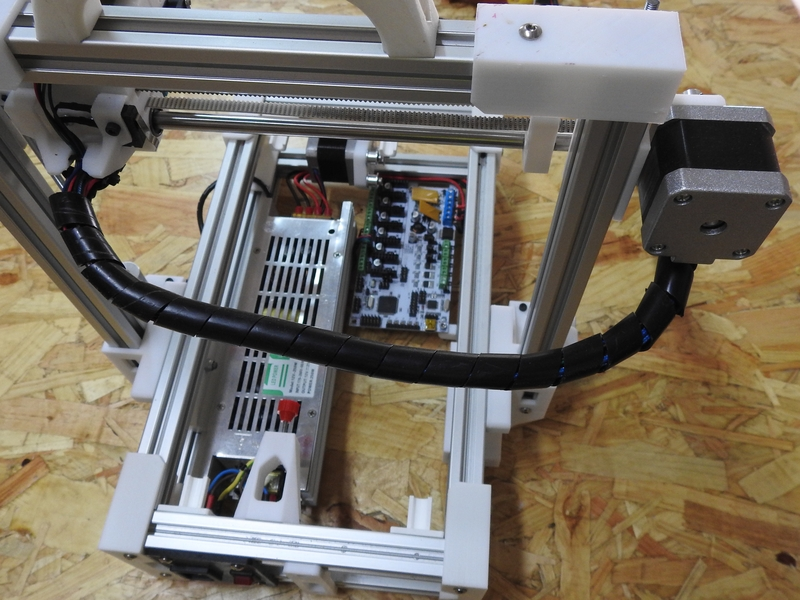

Pasa el mazo de cables por debajo del motor del Eje X y usa un par de bridas de nylon (cintillos) para amarrarlos bien.

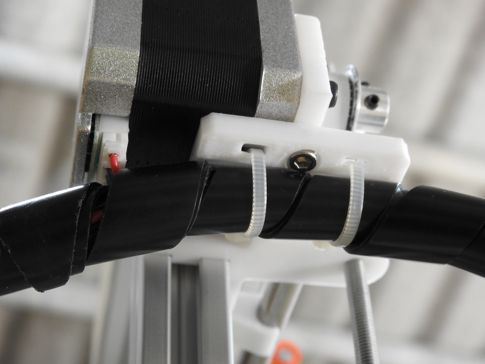

Si el mazo de cables es largo, como ocurre en el modelo Super Foldarap, tendrás que utilizar un refuerzo para mantenerlo semirígido, de lo contrario, es muy probable que se enganche en la bandeja de impresión (cama) cuando esté funcionando. 

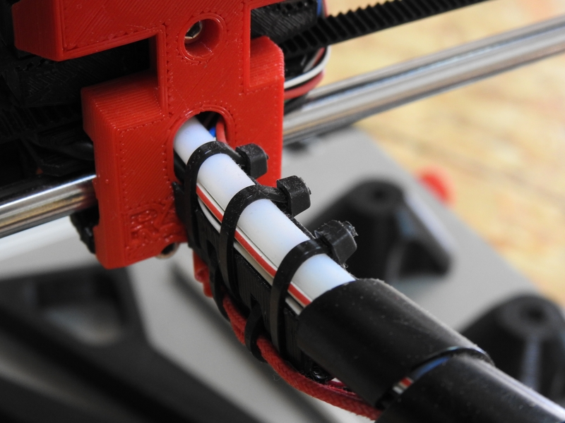

Para esto, puedes emplear un trozo de guía de cable como el que emplean los electricistas para meter los cables en los tubos corrugados de los edificios. También puede valer un trozo de tubo de teflón de 6mm, como el que se muestra en las imágenes.

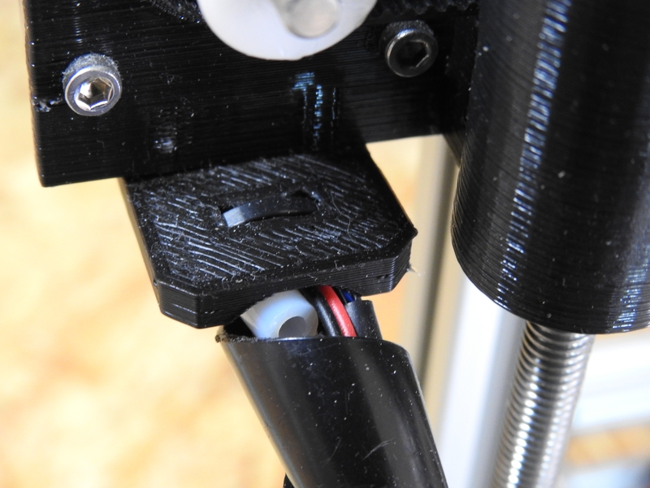

Una vez hecho esto, podemos continuar con los cables de los motores. Sigue la misma secuencia de colores en todos los motores, facilitará la configuración de la impresora.

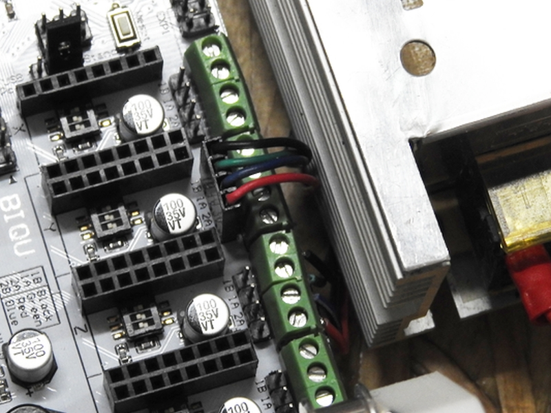

A continuación, se pueden conectar los cables de los finales de carrera, los ventiladores del fusor, el cartucho calentador, el termistor, inductivo (o BLTouch) si lo usas, etc... Trata de ser limipio en el cableado pasando los cables **siempre** por debajo de la tarjeta. Esto te facilitará acceder a los drivers de forma directa.

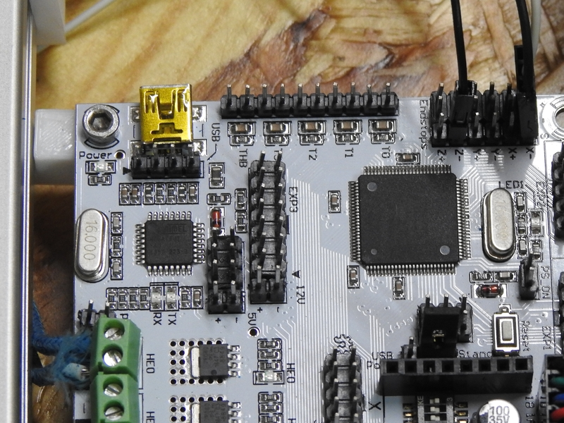

Finalmente, toca el turno a la cama caliente para aquellos modelos que la incluyen de serie (DDE y Super Folda). Se remite a las instrucciones del vendedor sobre cómo soldar los cables de la cama (si fuera necesario) y los del termistor. En la imagen se muestra una cama Mk3 cableada para 12v.

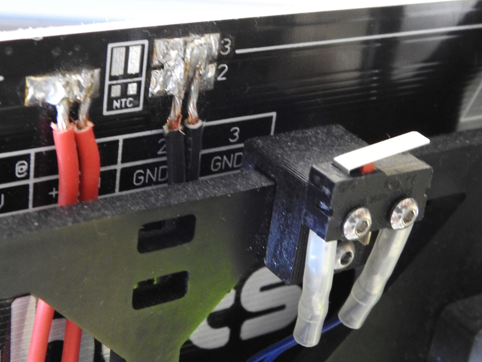

Aquí podemos tener dos casos:

- Si la tarjeta elegida soporta la corriente de la cama, conecta los cables de la misma a los terminales correspondientes. En esta ocasión, no importaría la polaridad. Consulta el esquema de la tarjeta si no sabes cuáles son esos terminales.

- Si la tarjeta no está preparada para ello (como ocurre con el modelo Super Foldarap montado que usa la tarjeta [KFB v2.0](https://www.biqu.equipment/products/3d-mother-board-kfb3-0-12v-update-kfb2-0-suitable-for-a4988-and-lcd-2004)), será necesario un **mosfet externo** (o relé) para poder soportar la corriente que demanda la cama. El esquema de conexiones en este caso se muestra en la imagen siguiente:

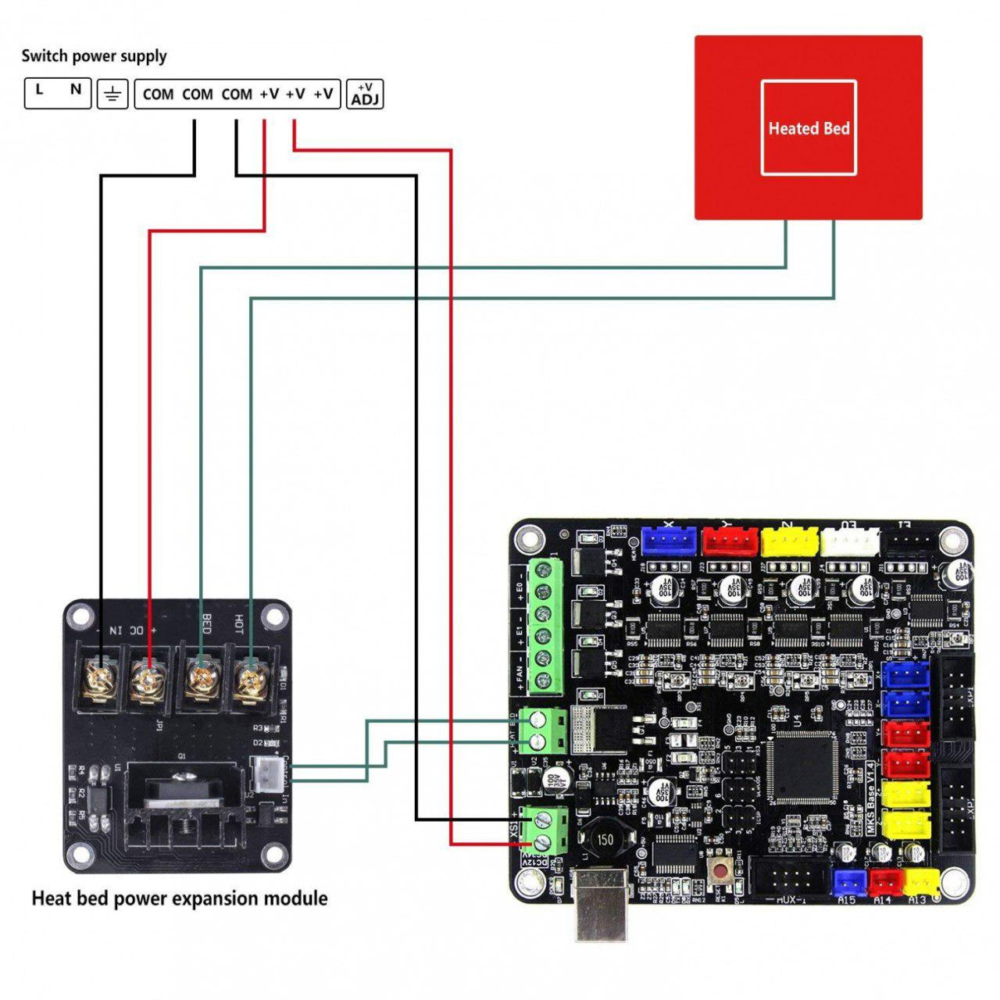

Y así es como queda montado en la realidad:

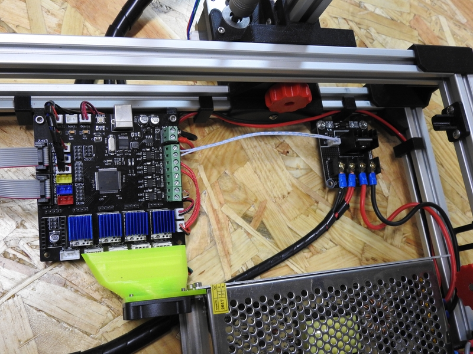

Para finalizar, colocaremos la correa del Eje Y según se indica en las imágenes.

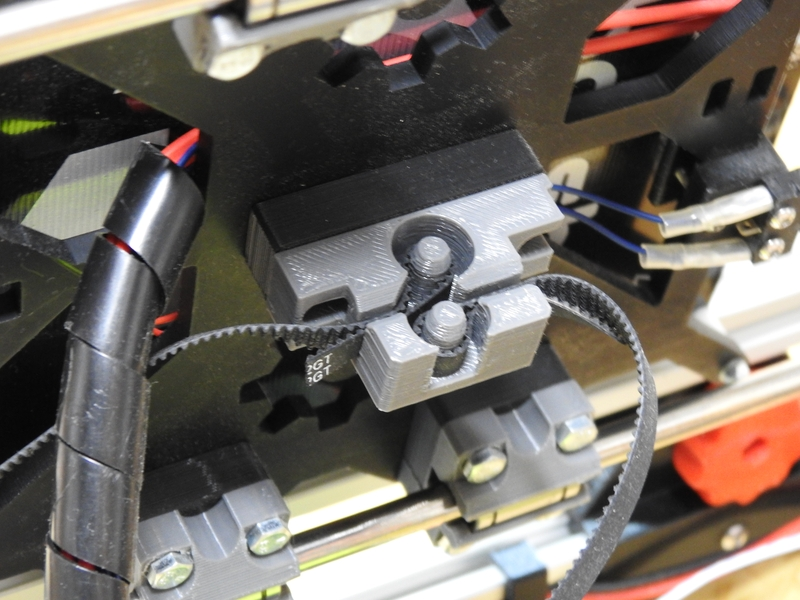

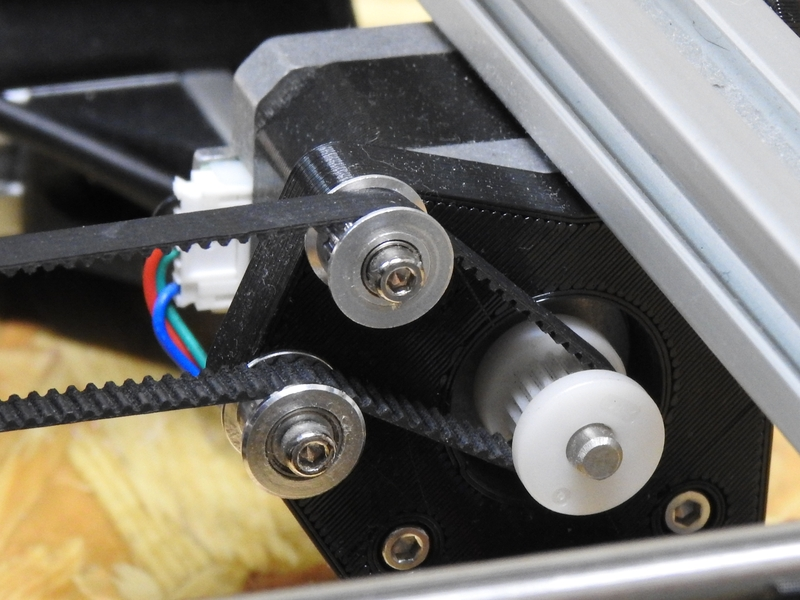

Ya lo tenemos todo. Ahora sólo queda comprobar que llega alimentación a todos los componentes y configurar Marlin para empezar a imprimir.

