Un problema muy común, especialmente entre la gente recién llegada al mundo de la impresión 3D, es que no saben cuánto consume su impresora. Esto es un punto importante porque en algunos casos tendremos que proceder a cambiarla, bien porque se nos ha roto, bien porque pensamos realizar alguna ampliación en la máquina. Si se nos ha roto, bastaría con adquirir una similar en potencia y voltaje para poder salir del paso. Si estamos ante la segunda opción, conviene tener en cuenta la magnitud de la potencia nueva a instalar para comprobar si la fuente que ya tenemos es capaz de dar el servicio que se le va a pedir.

En ambos casos, es importante saber cuánta es la potencia eléctrica que consume cada una de las partes integrantes de la misma. Por este motivo, y antes de describir el proceso de cableado de la fuente de alimentación, se darán unas pautas para establecer, en líneas generales, la metodología a seguir para seleccionarla. 

A modo de resumen, los puntos a tener en cuenta son:

- **Voltaje de alimentación de la fuente (C.A.):** En Europa y otras partes del mundo se ***emplean 220-230v*** a 50Hz de corriente alterna, pero en paises como USA este voltaje baja a 110v a 60Hz. Ten presente esto a la hora de comprar la fuente, y fíjate en las ofertas de las tiendas web. Podrías quemarla sin posibilidad de recuperar tu dinero por pérdida de garantía.

- ***Voltaje de salida (C.C.):*** Usualmente suelen ser de 12v o bien de 24v en corriente contínua. Antaño se podía ver alguna de 19v, aunque ya no se usan. También es habitual usar fuentes de alimentación de tipo ATX, empleadas en los ordenadores personales de escritorio. Sea como sea, ___la mejor opción es usar 24v___ como se indicará en el punto siguiente.

- ***Amperaje de salida (C.C.):*** Junto con el voltaje (o tensión de salida) determina el consumo que una fuente puede abastecer sin deteriorarse/quemarse. Cuanta más corriente pueda ofrecer, más fácil resultará calentar la cama/fusor y con más brío se moverán los motores. Pero esto tiene un precio: ___el calor___. Por tanto, la mejor opción para mantener la fuerza (par) en los motores y rapidez en alcanzar las temperaturas de impresión es ___elevar el valor del voltaje___.

- **Consumo por componente:** Con todo lo anterior, y teniendo en cuenta que ___la potencia que consume un componente es el producto del voltaje al que está siendo alimentado por la corriente que absorbe___ (P=VxI), podemos dar una cuenta aproximada en watios (unidad de potencia eléctrica) del consumo de cada componente en una impresora:

|	| Consumo Mín. | Consumo Máx. |
------------ |--------------|----------------|
Motores | 5w/motor (x5) | 12w/motor (x5)
Fusor | 30w | 80w
Cama caliente | 100w | 150w
Electrónica| 2w | 5w
Margen seguridad | 25% | 40%
TOTAL | 196,25w | 413w

En este cálculo estimado, se incluyen 5 motores que suele ser lo habitual, aunque hay máquinas con sólo 4 y máquinas con más de 5 (multi-extrusor). 

El valor de la potencia del fusor no es constante, sólo se aplica al momento en el que se calienta hasta alcanzar la temperatura de consigna. Puede variar desde los 30w de los más corrientes, a los 80w de un [Supervolcano](https://e3d-online.com/the-e3d-supervolcano).
  
En lo que se refiere a la cama caliente, últimamente son habituales las de corriente alterna a 220v/110v que funcionan a través de un mosfet de potencia o un relé. La cama a la que están conectados es capaz de consumir de 400/800w y alcanza la temperatura de consigna en segundos. No se incluyen en el cómputo porque **no van alimentadas** desde la fuente de corriente contínua.

La electrónica es la parte con un consumo menor de toda la impresora. En este caso se ha contabilizado el consumo de la placa de control sola y el de la placa+pantalla+ventiladores.

El **margen de seguridad** es un valor que no sólo recomiendan los fabricantes respetar, si no que también lo indica el sentido común. Tener una fuente de alimentación trabajando a su máxima capacidad es garantía, antes o después, de fallo. En este sentido, algunos fabricantes recomiendan dejar al menos, un 25% de margen, mientras que otros suben ese margen hasta el 35 ó 40%.

En resumidas cuentas, a la hora de adquirir una fuente de alimentación, está será capaz de proporcionar, **como mínimo, 200w** para poder funcionar con garantías. Cualquier valor por encima de éste nos ofrecerá mayor tranquilidad a la hora de decidir una ampliación o si va a ser una máquina que esté funcionando en "modo _heavy duty_" (24/7).

Si quieres profundizar en el tema de las fuentes de alimentación, se dejan un par de enlaces a continuación (hay muchos más en la red de redes, sólo tienes que buscar un poco):

[3D Printer Power Supply – How to Choose the Right One](https://all3dp.com/2/3d-printer-power-supply-how-to-choose-the-right-one/) (en inglés).

[Fuentes de alimentación de impresoras 3d](http://deimpresoras3d.com/fuentes-de-alimentacion-de-impresoras-3d/) (en español).

Ahora sí, vamos con las instrucciones de cableado.

---

### Material para los modelos DDE y Super

El material necesario para montar la fuente de alimentación y su cableado se muestra en la imagen siguiente:

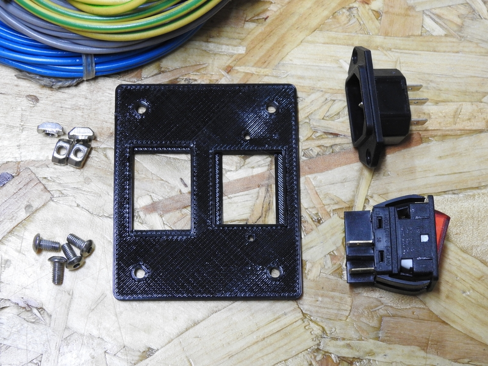

- 1 x Pieza ___IEC-plate-x1___.
- 4 x tornillos M4 de 8mm.
- 4 x tuercas T de rosca M4.
- 1 x Interruptor de CA 10A 250V.
- 1 x Conector IEC para 10A 250V.
- 20-25 cm de cable de 0,75-1,5mm de sección en varios colores (3 trozos de la distancia indicada cada uno son suficientes).

Lo primero de todo es montar la fuente de alimentación si no está aún montada. Para ello se necesitarán:

- 2 x piezas ___psu-holder-x2___ impresas.
- 4 x tornillos M4x8mm.
- 4 x tuercas T de métrica M4.
- 1 x fuente de alimentación.
- Cinta adhesiva de doble cara.

Utiliza la cinta adhesiva para fijar la fuente a las piezas de soporte (psu-holder) y los tornillos/tuercas para unir el conjunto a la parte baja del perfil, según se muestra en la siguiente imagen. No acerques demasiado la fuente a la parte trasera de la impresora, o no tendrás espacio para los cables.

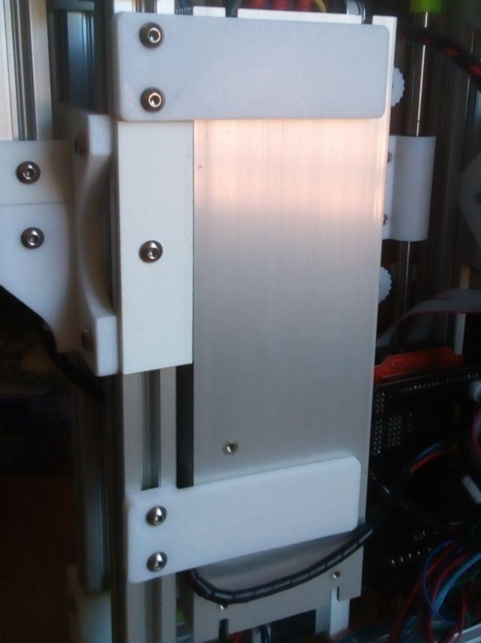

Con la fuente colocada, instala el conector IEC y el interruptor en la pletina _IEC-plate-x1_. Utiliza las imagenes siguientes para orientarte durante el proceso.

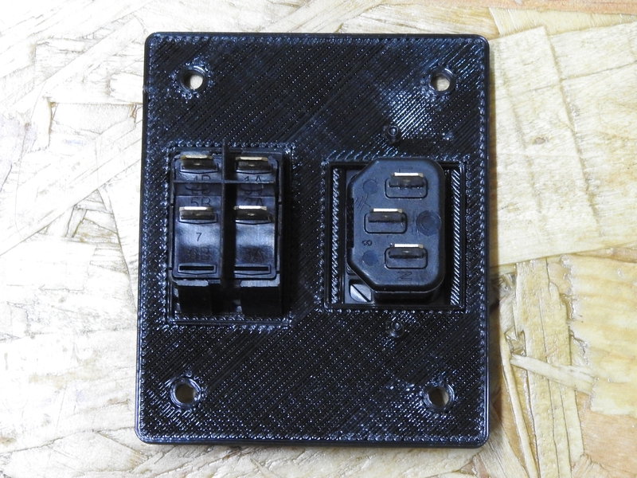

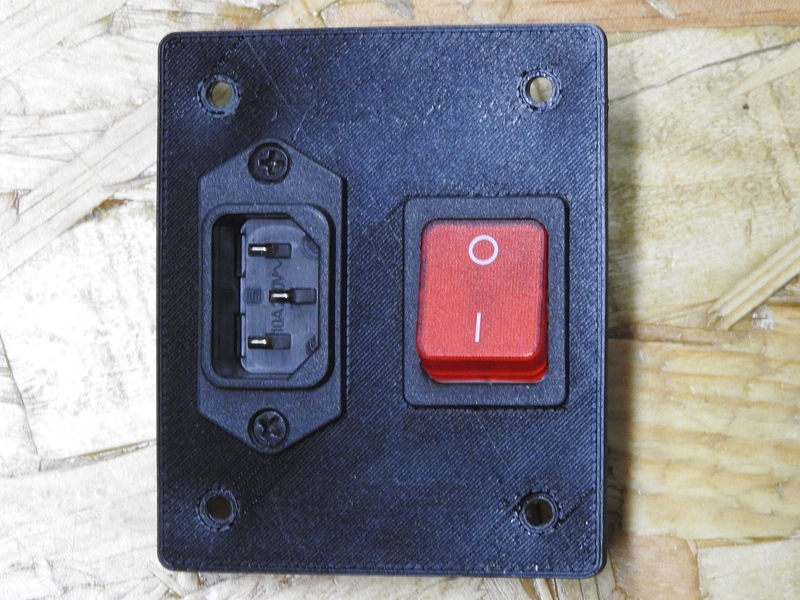

Ahora hay que preparar los cables de conexión. Para esto, es muy práctico usar conectores de tipo **Faston**, pues permiten ser retirados/conectados con mucha facilidad, lo que simplifica los montajes y el mantenimiento. Si no tienes estos conectores, más adelante se indica cómo solucionar la situación.
  
El proceso es sencillo. Se cortan 3 trozos de cable de unos 12-15cm y se pela la funda unos 5mm en todas las puntas.

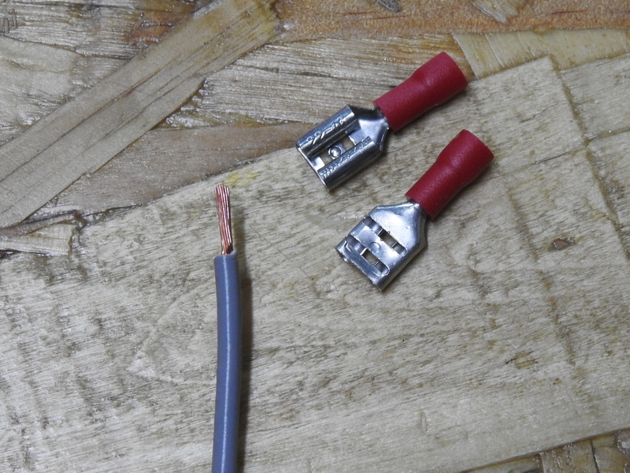

En una de las puntas se empleará un conector de tipo _faston plano_ del ancho de los terminales del interruptor y conector IEC usados. Suelen ser de 6,3mm. En el otro extremo de los cables emplearemos conectores _faston en horquilla_. Asegúrate de que el ancho de los conectores usados coincide con el de los terminales de tu fuente de alimentación. 

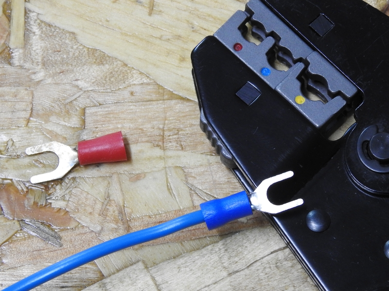

Al final del proceso, los cables deben quedar de forma similar a como se muestra en la imagen siguiente. Estos cables que acabas de preparar llevarán la corriente desde el interruptor a la fuente.

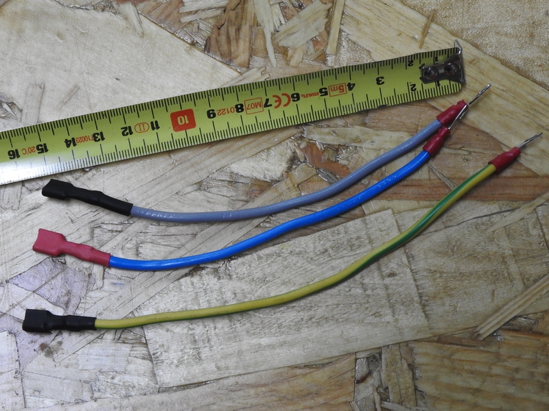

También necesitamos preparar un par de trozos de cable de 10cm de forma similar al proceso seguido anteriormente. Estos trozos llevarán la corriente del conector IEC al interruptor.

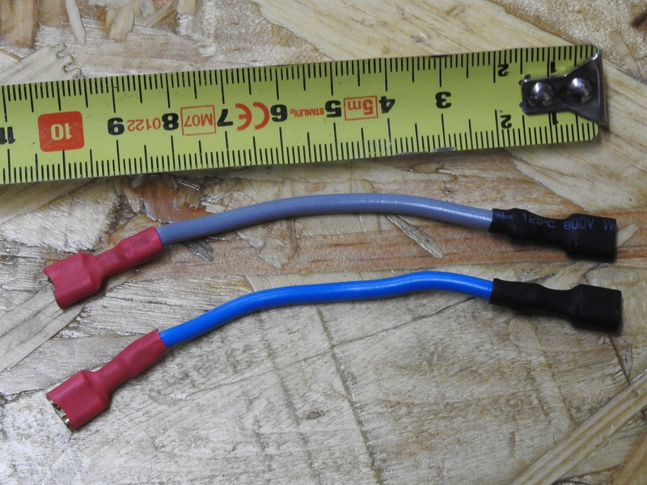

Si no se dispone de conectores faston ni de tenaza para engastar conectores, se puede utilizar un **soldador (estañador o cautín)** para estañar los cables a los terminales de los conectores. En las imágenes siguientes se muestra cómo deben ir conectados los cables en cada terminal. Si es la primera vez que usas un estañador, ¡¡ten cuidado, podrías quemarte!!.
  
Este proceso es el mismo tanto si se utilizan conectores faston como si se usa estañador. Fíjate bien en la secuencia para no comenter errores. 

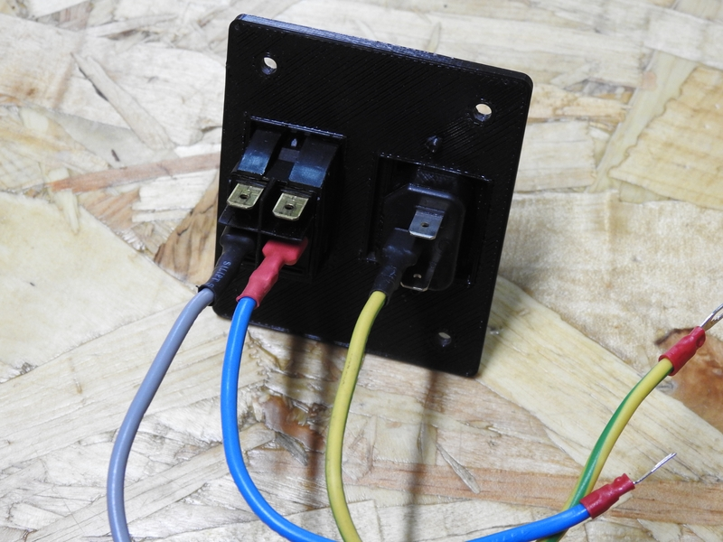

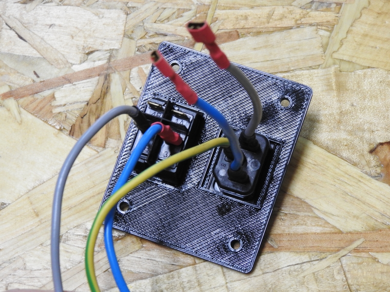

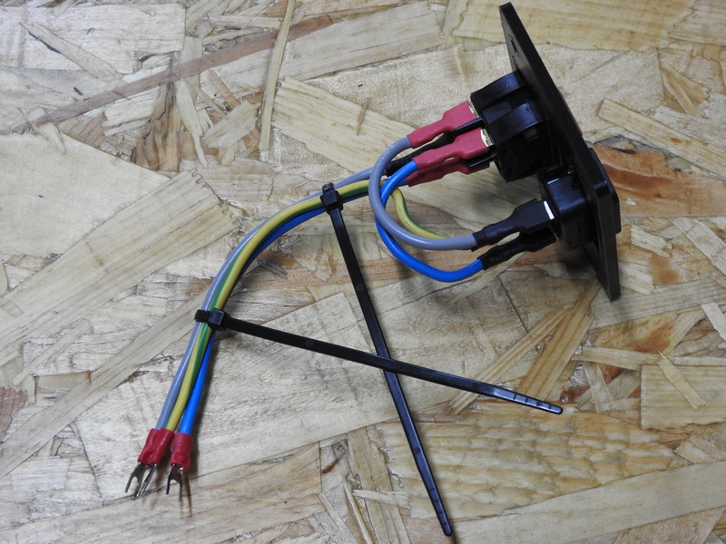

El aspecto final de la pletina de alimentación debe parecerse al de la imagen anterior. Te puedes ayudar de un par de bridas de nylon o cintillos para mantener sujetos los cables y evitar que se enreden.

Con los cables listos, lo siguiente es instalar los tornillos de sujección de la pletina al perfil.

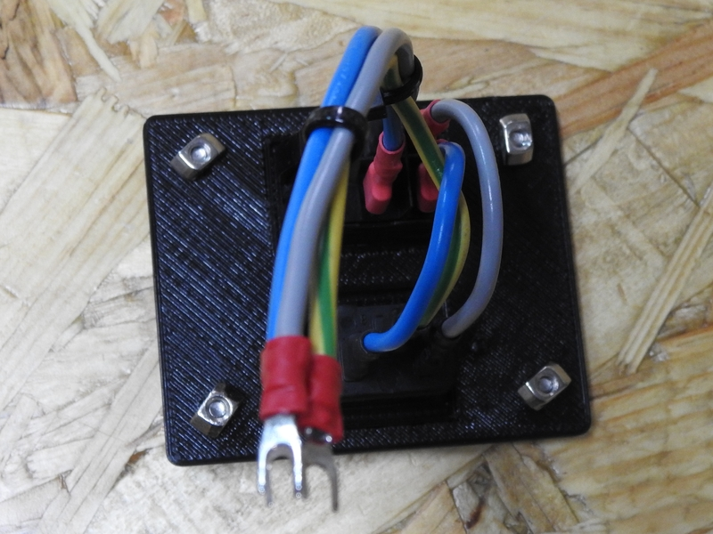

Ya casi está. Vamos a acabar de cablear la fuente de alimentación conectando las puntas de los cables con los conectores faston en horquilla en su lugar. Las fuentes de alimentación que usan estos modelos son todas muy parecidas, tienen 3 contactos llamados **L, N y GND** que son la _(L)ínea_, _(N)eutro_ y _Tierra_ del enchufe de la pared de tu casa. A veces, la tierra viene indicada con un símbolo que parece un triángulo invertido con líneas horizontales (ver imagen siguiente).

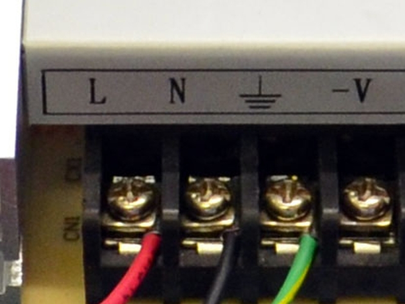

Conectaremos la línea y neutro en las posiciones indicadas como L y N de la fuente de alimentación. No importa si por descuido las intercambias, no hay peligro por ello. **Sí se debe poner cuidado** en que la tierra vaya con su conector correspondiente (el cable de color amarillo-verde de las imágenes). 

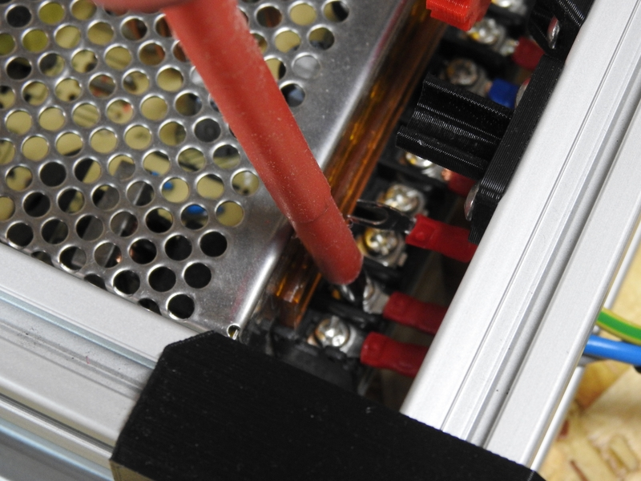

Al final, las conexiones te deben quedar según la imagen siguiente:

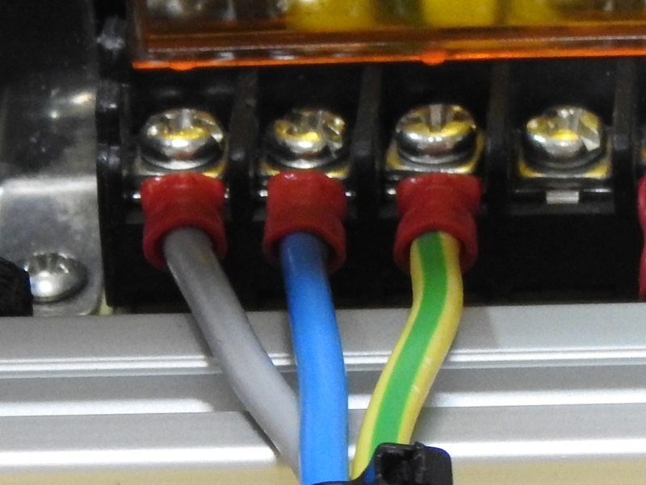

Ya sólo nos queda atornillar la pletina a la parte trasera de la impresora y ¡listo!. 

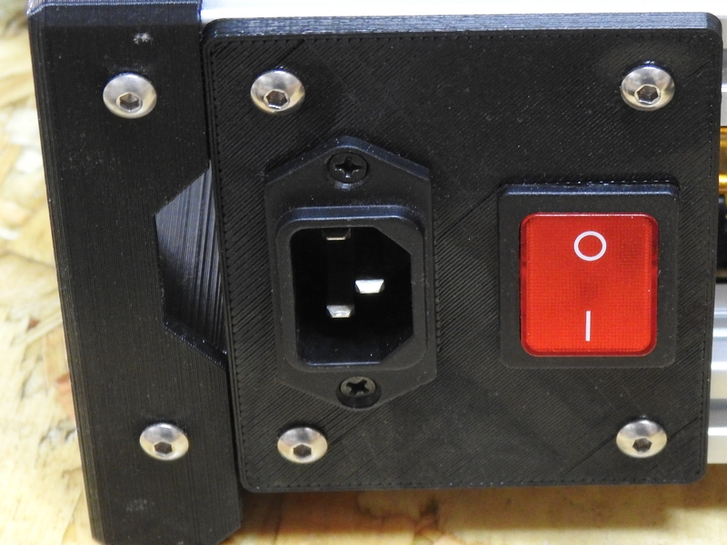

Puedes probar a enchufar la impresora a la toma de corriente de la pared. Cuando acciones el interruptor, comprueba con un multímetro el valor de la tensión de salida de la fuente (los terminales V+ y V-). Si no tienes multímetro, prueba a conectar algún dispositivo que tengas a mano y que sepas que funciona con el voltaje de la fuente. Los ventiladores de la impresora son la mejor opción. En cualquier caso, deberías ver encendido un indicador testigo en la salida de la fuente, aunque no todas las fuentes lo incluyen, depende del fabricante.
  
---

### Material para el modelo Mini
Para el modelo Mini Foldarap, los materiales a emplear cambian ligeramente:

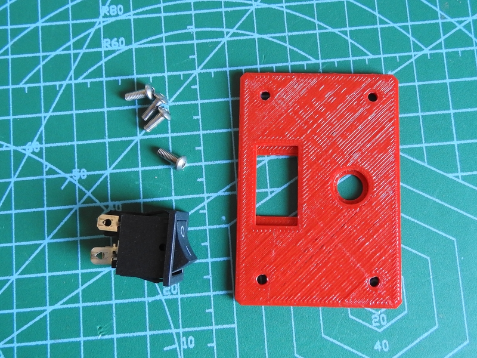

- 1 x pieza ___PSU-switch-plate-x1___.
- 4 x tornillos M3x8mm.
- 4 x tuercas M3.
- 1 x Interruptor bipolar de CC 10A 12V.
- 1 x Conector Jack de CC 10A 30V.
- 20-25cm de cable de 1,5mm de sección (en rojo y negro a ser posible, dos trozos de la distancia indicada).

En este modelo la fuente de alimentación empleada es externa, así que no necesitamos instalarla antes. El proceso es muy similar al descrito para los modelos anteriores, por lo que se simplificarán las explicaciones.

Como material extra tenemos el conector jack de entrada de corriente, de manera que empezaremos con él.

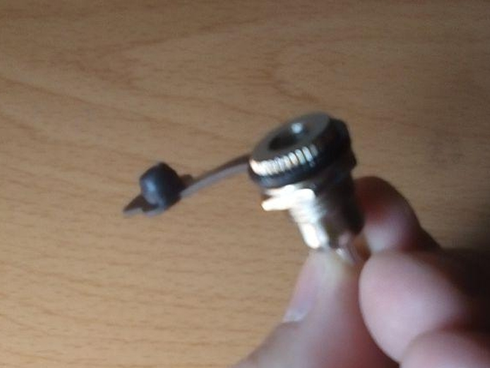

Lo primero de todo es identificar la polaridad de la fuente de alimentación que usamos, es decir, ya que estamos usando una fuente de alimentación similar a la usada por los ordenadores portátiles, necesitamos saber cuál es el terminal positivo en la clavija de salida de la fuente. Para ello, miramos la placa de datos de dicha fuente:

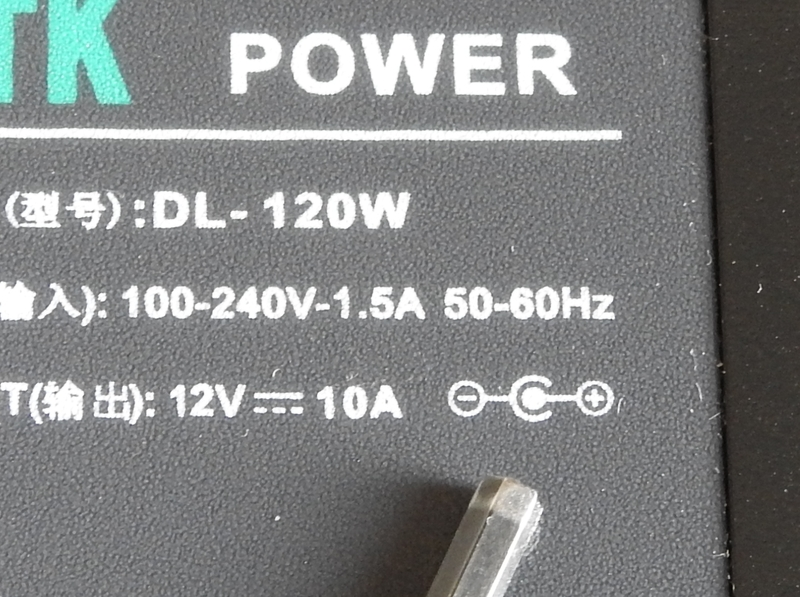

El esquema de la parte inferior derecha de la imagen nos indica que el positivo de la fuente es la clavija central y la pared exterior es masa (negativo). Con esta información, prepararemos dos trozos de cable de 10cm, como en el caso anterior, y los identificaremos según se muestra en la imagen: el **rojo es positivo** (¡¡siempre!!) y el negro negativo.

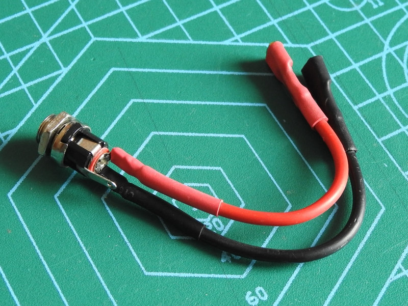

Fíjate que el cable rojo está unido al conector central de la clavija jack y el negro a una de las exteriores. Utiliza tubo termoretráctil para aislar los terminales. Así se evita que lleguen a tocarse por el motivo que sea. Si no tienes termoretráctil puedes usar cinta aislante.

Con este detalle en cuenta, el resto de conexiones se muestran en las imágenes siguientes:

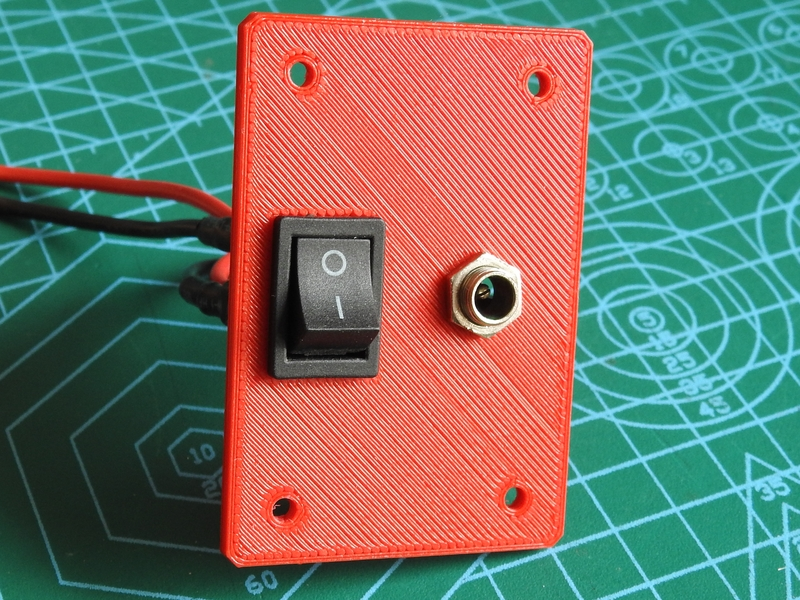

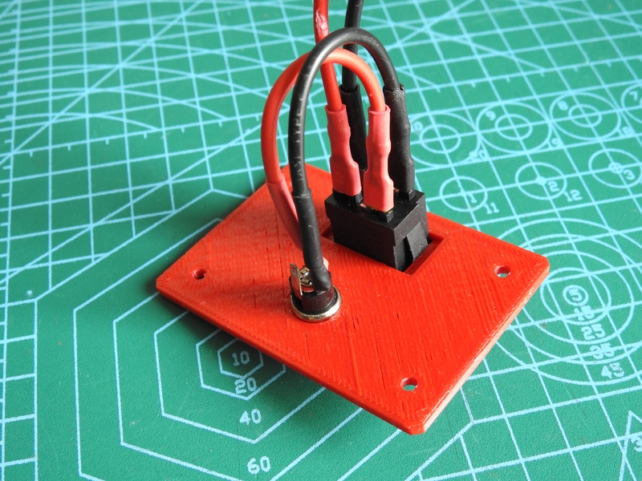

Acabamos el trabajo atornillando la pletina a la impresora en su parte trasera.

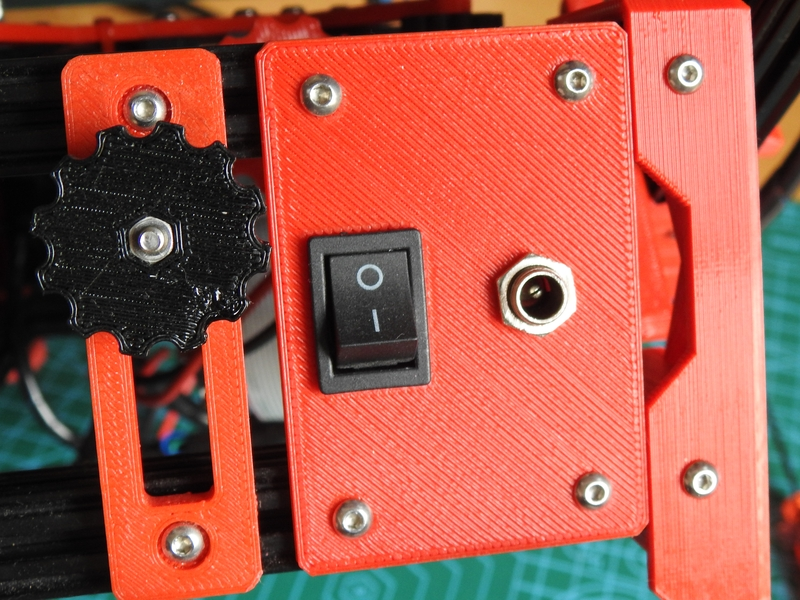
