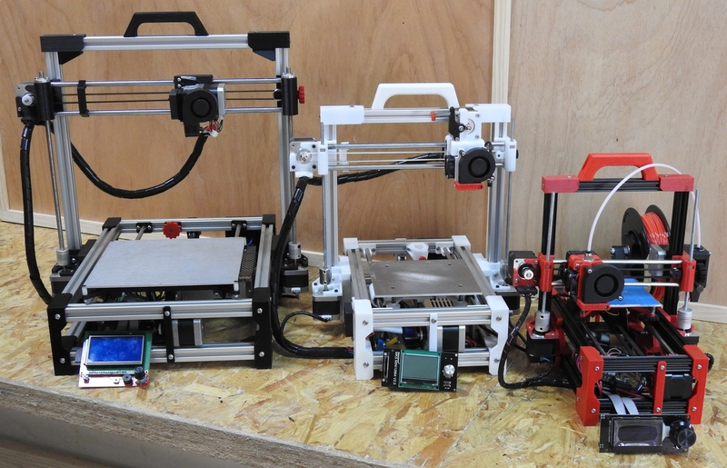

Bienvenido al Wiki de la Foldarap Escalable, una impresora plegable que puede ensamblarse en varios tamaños. Esto es debido a la parametrización de los ficheros fuente que utiliza.

Ya hay disponible una versión estable de los tres modelos de impresora, así como de los ficheros fuente [Freecad](https://www.freecadweb.org/) que te permitirán personalizar el tuyo.

También hay disponible un [grupo de Telegram](https://t.me/scalable_foldarap) donde puedes preguntar cualquier duda que te surja o hacer alguna sugerencia que se te ocurra.

__AGRADECIMIENTOS__

* [EnmanuelG/OpenEdge](https://github.com/OpenEdge), foldarap design.
* [ffleurey](https://www.thingiverse.com/thing:147705), direct-drive hinged extruder.
* [rowokii](https://www.thingiverse.com/thing:767317), parametric universal spool holder.
* [judetomate](https://www.thingiverse.com/thing:47752), spool holder idea.
* [Campy3D](https://www.thingiverse.com/thing:2915718), LCD MKS Mini 12864 Mount Enclosure Box.
* [bipsen](http://www.thingiverse.com/thing:3558349), Case/holder for Fysetc Mini 12864 Display.
* [Asphyth](https://www.thingiverse.com/thing:2470605), Case for LCD Screen Full Graphic 128x64 multiple stand.

A todos ellos, ¡¡¡MUCHAS GRACIAS por vuestro trabajo!!!