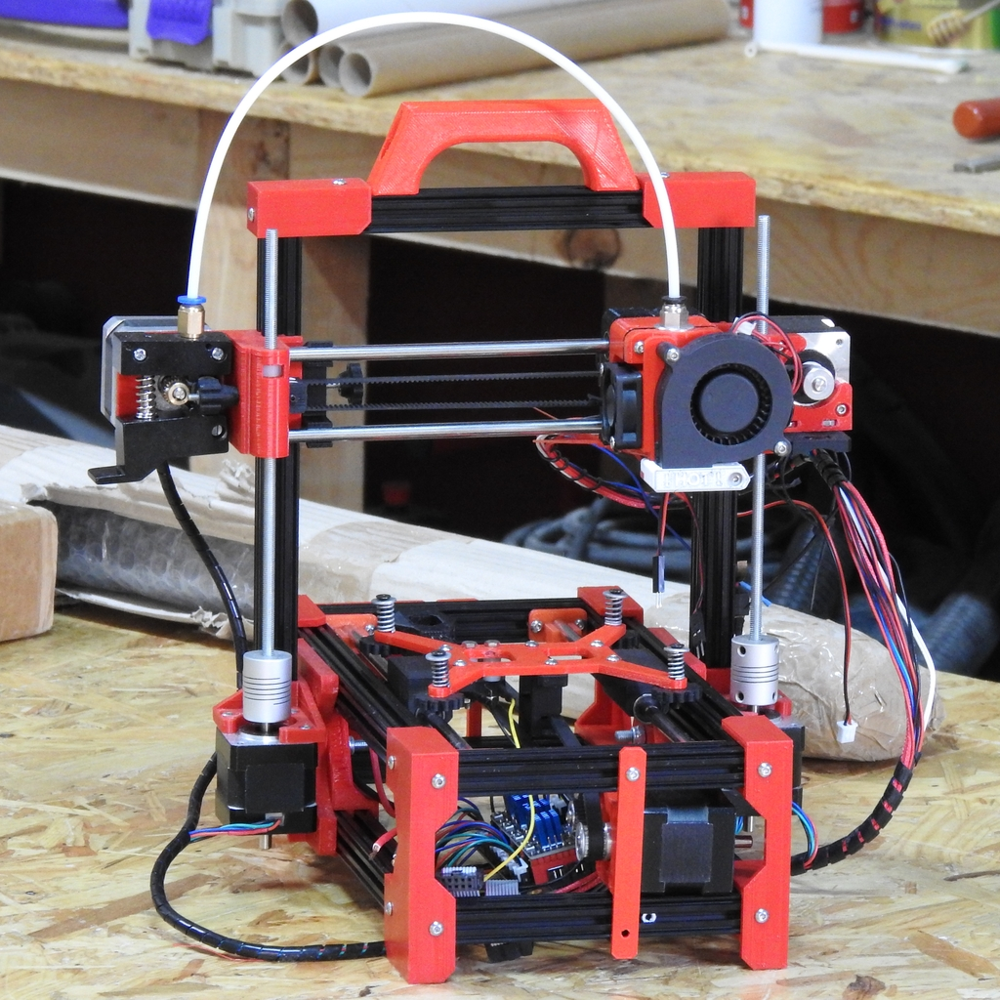
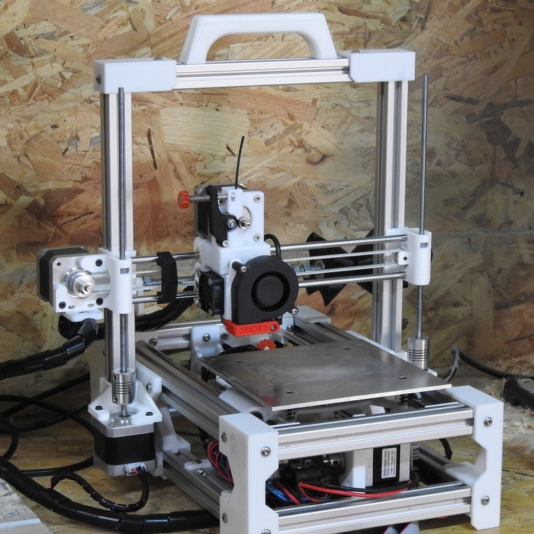
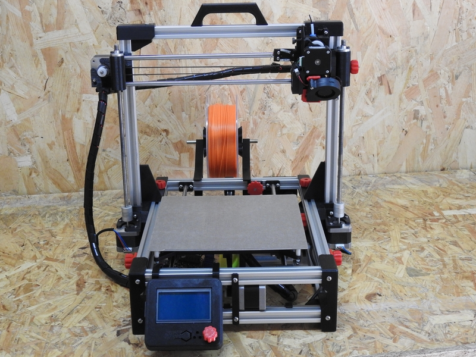

La información que sigue a continuación es un listado **PROVISIONAL** de los materiales necesarios para el montaje y puesta en marcha de una impresora Foldarap parametrizable. Antes de comprar algún elemento, selecciona el tipo de impresora que mejor se ajusta a tus necesidades leyendo la información de este [apartado](https://github.com/isidorogv/foldarap_escalable/wiki/Informaci%C3%B3n-previa).

---

### Mini Foldarap

#### Características
**Volumen de Impresión:** 10x10x10cm

**Tamaño plegada:** 30x42x12cm (ancho x alto x fondo)

**Tamaño desplegada:** 30x32x27cm (ancho x alto x fondo)

**Peso:** 2,9Kg

**Perfil de aluminio usado:** 15x15mm con ranura de 3mm (Makerbeam/Openbeam)

**Velocidad de impresión:** 50-60mm/s (máx.)

**Tipo de extrusor:** Bowden Directo

**Diámetro de Boquilla:** 0.4mm

**Cama Caliente:** No (Se puede instalar como mejora)

**Pantalla LCD:** No (se puede instalar como mejora)

**Tipo de filamento:** PLA, TPU 

---

#### Materiales
- 2 x 20 cm varilla lisa 6mm de diámetro (eje X)
- 2 x 23 cm varilla lisa 6mm de diámetro (eje Y)
- 2 x 18 cm varilla roscada M5 (eje Z)
- 2 x acoples de 5mm de diámetro interno (eje Z)
- 8 x rodamientos lineales LM6 ó Igus LM6 (ejes X e Y)
- 6 x perfiles de aluminio 15x15 de 24cm
- 5 x perfiles de aluminio 15x15 de 14cm
- 8 x [Posicionadores de bola con resorte](https://www.amazon.es/gp/product/B00S4YZYNM/ref=ppx_yo_dt_b_asin_title_o03_s00?ie=UTF8&psc=1)
- 3 x finales de carrera mecánicos
- 4 x [poleas síncronicas](https://www.amazon.es/gp/product/B01LO125N8/ref=ppx_yo_dt_b_search_asin_title?ie=UTF8&psc=1) de 16mm/3mm (dia. ext./dia. int.)

- 2 x [poleas de tracción](https://www.amazon.es/UEETEK-aluminio-s%C3%ADmbolo-di%C3%A1metro-impresora/dp/B06XF2Z49Q/ref=pd_sbs_328_3/257-9620304-2259210?_encoding=UTF8&pd_rd_i=B06XF2Z49Q&pd_rd_r=6b7f5ffd-7fa2-11e9-8290-1f7ef5cdf6ea&pd_rd_w=0Ne6K&pd_rd_wg=ad4n4&pf_rd_p=f9384d3f-fa3d-4e25-8bc3-b0c7853cd8a6&pf_rd_r=64NY7AP4VF7PFPWW11HV&psc=1&refRID=64NY7AP4VF7PFPWW11HV) para los ejes X e Y
- 1 x 1m de [correa GT2 de 6mm](https://www.amazon.es/dp/B01H6YE0TY/ref=sspa_dk_detail_4?psc=1&pd_rd_i=B01H6YE0TY&pd_rd_w=oe0gX&pf_rd_p=bb91eb88-db8c-4e25-86ef-3dc2db362fa7&pd_rd_wg=ad4n4&pf_rd_r=64NY7AP4VF7PFPWW11HV&pd_rd_r=6b7f5ffd-7fa2-11e9-8290-1f7ef5cdf6ea) de ancho
- 4 x motores NEMA14 para los ejes
- 1 x motor NEMA17 para el extrusor
- 1 x bolsa de 100 tornillos M3 allen de 8mm
- 1 x bolsa de 100 tuercas M3
- 8 x tornillos M3 allen de 20mm (fusor y ajustes de los finales de carrera)
- 2 x tornillos M5 de 16 ó 20mm de largo (preferible phillips ó allen)
- 2 x tuercas M5 autoblocantes (para las bisagras de plegado)
- 2 x [prisioneros M3 de 16mm](https://www.amazon.es/sourcingmap%C2%AE-hexagonal-inoxidable-tornillos-prisioneros/dp/B01AXVSM6O/ref=sr_1_1?__mk_es_ES=%C3%85M%C3%85%C5%BD%C3%95%C3%91&keywords=prisionero+M3+16mm&qid=1558870535&s=gateway&sr=8-1)
- 4 x muelles para la cama
- 1 x fuente de alimentación 24v/240w
- 1 x interruptor bipolar de 220v/10A
- 1 x clavija jack hembra de 2.1mm de diámetro para montar en panel
- 1 x tarjeta electrónica de control (arduino+ramps ó equivalente)
- 4 x amplificadores(drivers) para motor A4988/DRV8825 ó equivalentes
- 1 x fusor de tipo E3D para bowden ó similar.
- 1 x extrusor directo para bowden
- 1 x set de piezas impresas (ver apartado [Descripción de los ficheros fuente](https://github.com/isidorogv/foldarap_escalable/wiki/Ficheros-freecad))

#### Materiales Opcionales

- 1 x cama [caliente flexible 10x10cm (24v, 100w)](https://www.ebay.es/itm/Kapton-Film-Flexible-Heated-Bed-24V-100-300mm-Square-Round-3D-Printer-Heater/152429495518?hash=item237d8184de:m:mkmhdOSE_SzHJkcbh_U3uMw).
- 1 x sensor inductivo con rosca M8.
- 1 x panel LCD de control con selector (y lector de tarjetas, si la placa de control no lo tiene integrado).
- 1 x ventilador axial de capa a 24v/0.1A.

---

### FoldaRap DDE

#### Características
**Volumen de Impresión:** 14x14x14cm 

**Tamaño plegada:** 34x55x15cm (ancho x alto x fondo) 

**Tamaño desplegada:** 34x36x38cm (ancho x alto x fondo) 

**Peso:** 5.8Kg 

**Perfil de aluminio usado:** 20x20 Tipo I (ranura de 6mm) T-slot.

**Velocidad de impresión:** 40-50mm/s (máx.) 

**Tipo de extrusor:** Extrusor Directo (Extrusor Bowden Directo opcional) 

**Diámetro de Boquilla:** 0.4mm 

**Cama Caliente:** Sí 

**Pantalla LCD:** No (se puede instalar como mejora) 

**Tipo de filamento:** PLA, ABS, PETG, TPU

---

#### Materiales
- 2 x 26 cm varilla lisa 6mm de diámetro (eje X)
- 2 x 29 cm varilla lisa 6mm de diámetro (eje Y)
- 2 x 23 cm varilla roscada M5 (eje Z)

- 2 x acoples de 5mm de diámetro interno (eje Z)

- 8 x rodamientos lineales LM6 ó Igus LM6 (ejes X e Y)

- 6 x perfiles de aluminio 20x20 de 30cm
- 5 x perfiles de aluminio 20x20 de 20cm

- 8 x [Posicionadores de bola con resorte](https://www.kipp.es/es/es/Productos/Elementos-de-mando-Elementos-est%C3%A1ndar/Piezas-de-presi%C3%B3n-con-resorte-pernos-de-bloqueo-pernos-de-bloqueo-de-bola/Piezas-de-presi%C3%B3n-con-resorte-versi%C3%B3n-lisa-pl%C3%A1stico.html)

- 3 x finales de carrera mecánicos

- 4 x [poleas síncronicas](https://www.amazon.es/gp/product/B01LO125N8/ref=ppx_yo_dt_b_search_asin_title?ie=UTF8&psc=1) de 16mm/3mm (dia. ext./dia. int.)

- 2 x [poleas de tracción](https://www.amazon.es/UEETEK-aluminio-s%C3%ADmbolo-di%C3%A1metro-impresora/dp/B06XF2Z49Q/ref=pd_sbs_328_3/257-9620304-2259210?_encoding=UTF8&pd_rd_i=B06XF2Z49Q&pd_rd_r=6b7f5ffd-7fa2-11e9-8290-1f7ef5cdf6ea&pd_rd_w=0Ne6K&pd_rd_wg=ad4n4&pf_rd_p=f9384d3f-fa3d-4e25-8bc3-b0c7853cd8a6&pf_rd_r=64NY7AP4VF7PFPWW11HV&psc=1&refRID=64NY7AP4VF7PFPWW11HV) para los ejes X e Y

- 1 x 1.5m de [correa GT2 de 6mm](https://www.amazon.es/dp/B01H6YE0TY/ref=sspa_dk_detail_4?psc=1&pd_rd_i=B01H6YE0TY&pd_rd_w=oe0gX&pf_rd_p=bb91eb88-db8c-4e25-86ef-3dc2db362fa7&pd_rd_wg=ad4n4&pf_rd_r=64NY7AP4VF7PFPWW11HV&pd_rd_r=6b7f5ffd-7fa2-11e9-8290-1f7ef5cdf6ea) de ancho

- 5 x motores NEMA17 para los ejes y el extrusor (de al menos 36Ncm de par)

- 1 x bolsa de 100 tornillos M4 allen de 8mm
- 1 x bolsa de 100 tuercas-T M4
- 8 x tornillos M3 allen de 20mm (fusor y ajustes de los finales de carrera)
- 2 x tornillos M5 de 16 ó 20mm de largo (preferible phillips ó allen)
- 2 x tuercas M5 autoblocantes (para las bisagras de plegado)
- 2 x [prisioneros M3 de 16mm](https://www.amazon.es/sourcingmap%C2%AE-hexagonal-inoxidable-tornillos-prisioneros/dp/B01AXVSM6O/ref=sr_1_1?__mk_es_ES=%C3%85M%C3%85%C5%BD%C3%95%C3%91&keywords=prisionero+M3+16mm&qid=1558870535&s=gateway&sr=8-1)

- 1 x [cama caliente flexible 24v 100w](https://www.ebay.es/itm/Round-Square-Rubber-Heater-Pad-Mat-12V-24V-110V-220V-100W-to-500W-3D-Printer/163008998299?_trkparms=aid%3D555018%26algo%3DPL.SIM%26ao%3D2%26asc%3D20160323102634%26meid%3D38283b38029b471db437969a1de23171%26pid%3D100623%26rk%3D1%26rkt%3D6%26sd%3D152429495518%26itm%3D163008998299%26pmt%3D1%26noa%3D0%26pg%3D2047675%26algv%3DSimplAMLv5PairwiseWeb&_trksid=p2047675.c100623.m-1)
- 4 x muelles para la cama

- 1 x fuente de alimentación 24v (al menos 240w)
- 1 x interruptor bipolar de 220v/10A para montar en panel
- 1 x conector IEC de 220v para montar en panel

- 1 x tarjeta electrónica de control (arduino+ramps ó equivalente)

- 4 x amplificadores(drivers) para motor A4988/DRV8825 ó equivalentes, dependiendo del tipo de ellos que soporte tu tarjeta de control.

- 1 x fusor de tipo E3D directo universal ó similar.

- 1 x extrusor directo (no-bowden)

- 1 x set de piezas impresas (ver apartado [Descripción de los ficheros fuente](https://github.com/isidorogv/foldarap_escalable/wiki/Ficheros-freecad))

#### Materiales Opcionales
- 1 x sensor inductivo con rosca M8 (se podría usar un M12)
- 1 x panel LCD de control con selector (y lector de tarjetas si la placa de control no lo tiene integrado)
- 1 x ventilador axial de capa a 24v

---

### Super FoldaRap

#### Características
**Volumen de Impresión:** 22x22x18cm

**Tamaño plegada:** 45x71x17cm (ancho x alto x fondo)

**Tamaño desplegada:** 45x48x48cm (ancho x alto x fondo)

**Peso:** 7.5Kg

**Perfil de aluminio usado:** 20x20 Tipo I (ranura de 6mm) T-slot.

**Velocidad de impresión:** 50-60mm/s (máx.)

**Tipo de extrusor:** Extrusor Directo o Extrusor Bowden Directo (opcional)

**Diámetro de Boquilla:** 0.4mm

**Cama Caliente:** Sí

**Pantalla LCD:** Sí

**Tipo de filamento:** PLA, ABS, PETG, TPU

---

#### Materiales
- 2 x 38 cm varilla lisa 8mm de diámetro (eje X)
- 2 x 39 cm varilla lisa 8mm de diámetro (eje Y)
- 2 x 40 cm varilla roscada M5 (eje Z) ó husillo TR8x8 de la misma medida (se podría usar un par de 35cm si fuera el caso)

- 2 x acoples de 5mm de diámetro interno para eje Z (o de 8mm si es husillo)

- 8 x rodamientos lineales LM8 ó Igus LM8 (ejes X e Y)

- 6 x perfiles de aluminio 20x20 de 40cm
- 5 x perfiles de aluminio 20x20 de 30cm

- 8 x [Posicionadores de bola con resorte](https://www.kipp.es/es/es/Productos/Elementos-de-mando-Elementos-est%C3%A1ndar/Piezas-de-presi%C3%B3n-con-resorte-pernos-de-bloqueo-pernos-de-bloqueo-de-bola/Piezas-de-presi%C3%B3n-con-resorte-versi%C3%B3n-lisa-pl%C3%A1stico.html)

- 4 x [poleas síncronicas](https://www.amazon.es/gp/product/B01LO125N8/ref=ppx_yo_dt_b_search_asin_title?ie=UTF8&psc=1) de 16mm/3mm (dia. ext./dia. int.)

- 2 x [poleas de tracción](https://www.amazon.es/UEETEK-aluminio-s%C3%ADmbolo-di%C3%A1metro-impresora/dp/B06XF2Z49Q/ref=pd_sbs_328_3/257-9620304-2259210?_encoding=UTF8&pd_rd_i=B06XF2Z49Q&pd_rd_r=6b7f5ffd-7fa2-11e9-8290-1f7ef5cdf6ea&pd_rd_w=0Ne6K&pd_rd_wg=ad4n4&pf_rd_p=f9384d3f-fa3d-4e25-8bc3-b0c7853cd8a6&pf_rd_r=64NY7AP4VF7PFPWW11HV&psc=1&refRID=64NY7AP4VF7PFPWW11HV) para los ejes X e Y

- 1 x 2m de [correa GT2 de 6mm](https://www.amazon.es/dp/B01H6YE0TY/ref=sspa_dk_detail_4?psc=1&pd_rd_i=B01H6YE0TY&pd_rd_w=oe0gX&pf_rd_p=bb91eb88-db8c-4e25-86ef-3dc2db362fa7&pd_rd_wg=ad4n4&pf_rd_r=64NY7AP4VF7PFPWW11HV&pd_rd_r=6b7f5ffd-7fa2-11e9-8290-1f7ef5cdf6ea) de ancho

- 5 x motores NEMA17 para los ejes y el extrusor (de al menos 36Ncm de par)

- 1 x bolsa de 100 tornillos M4 allen de 8mm
- 1 x bolsa de 100 tuercas-T M4
- 8 x tornillos M3 allen de 20mm (fusor y ajustes de los finales de carrera)
- 2 x tornillos M5 de 16 ó 20mm de largo (preferible phillips ó allen)
- 2 x tuercas M5 autoblocantes (para las bisagras de plegado)
- 2 x [prisioneros M3 de 16mm](https://www.amazon.es/sourcingmap%C2%AE-hexagonal-inoxidable-tornillos-prisioneros/dp/B01AXVSM6O/ref=sr_1_1?__mk_es_ES=%C3%85M%C3%85%C5%BD%C3%95%C3%91&keywords=prisionero+M3+16mm&qid=1558870535&s=gateway&sr=8-1)

- 1 x cama caliente de 24v.
- 4 x muelles para la cama

- 1 x fuente de alimentación 24v (al menos 240w)
- 1 x interruptor bipolar de 220v/10A para montar en panel
- 1 x conector IEC de 220v/10A para montar en panel

- 1 x tarjeta electrónica de control (arduino+ramps ó equivalente)

- 4 x amplificadores(drivers) para motor A4988/DRV8825 ó equivalentes, dependiendo del tipo de ellos que soporte tu tarjeta de control.
- 1 x fusor de tipo E3D directo universal ó similar.

- 1 x extrusor directo (o extrusor bowden, según gusto del usuario)
- 2 x finales de carrera mecánicos

- 1 x sensor inductivo con rosca M8 (ó un M12), o también sonda BL-Touch.
- 1 x panel LCD de control con selector (y lector de tarjetas si la placa de control no lo tiene integrado).

- 1 x ventilador axial de capa a 12v/24v segúnla tensión de la fuente de alimentación usada.

- 1 x set de piezas impresas (ver apartado [Descripción de los ficheros fuente](https://github.com/isidorogv/foldarap_escalable/wiki/Ficheros-freecad))
