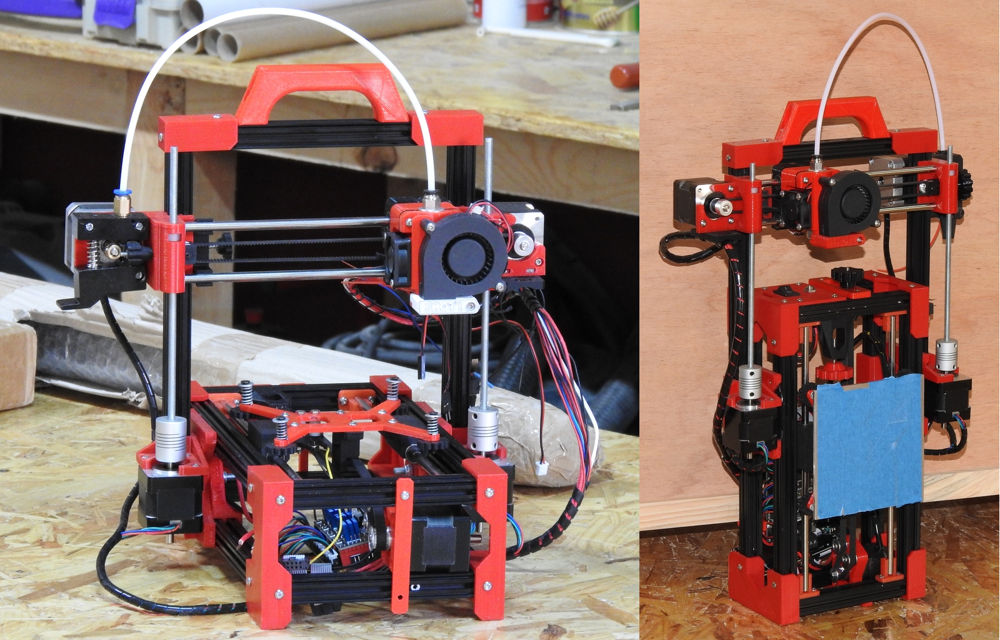
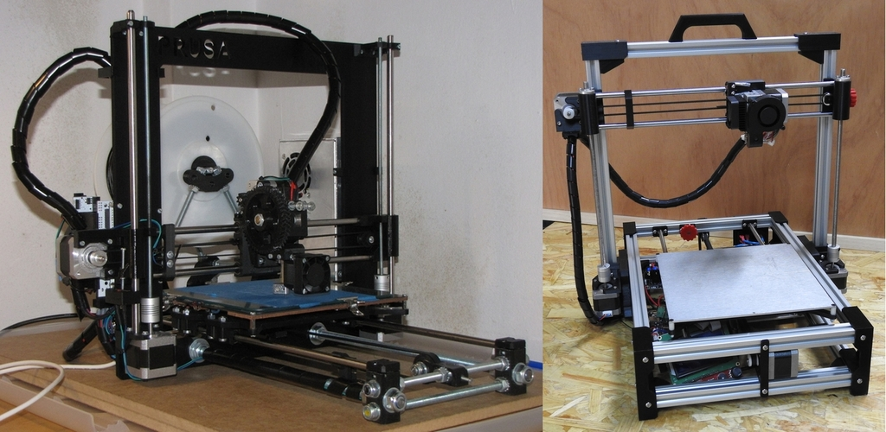

A continuación, se describe cada uno de los 3 tipos de impresora que se pueden construir con los ficheros STL que se encuentran en la carpeta del mismo nombre.

# Mini Foldarap

La _MiniFoldarap_ es el modelo con el menor volumen de impresión de los tres, concretamente es capaz de imprimir piezas de un tamaño máximo de _10x10x10 cm_. El peso de esta impresora ronda los 3 kg, y sus dimensiones son _30x42x12 cm_ plegada (anchox alto x fondo), y _30x32x27 cm_ cuando está desplegada y lista para imprimir. Su reducido tamaño y ligereza la convierten en el modelo más portable de los tres. Por su reducido tamaño, esta impresora **no puede** incluir la fuente de alimentación en su interior, al contrario que los otros dos modelos.

Otra particularidad de este modelo de impresora es el hecho de que está construida con perfil de alumino de _15x15mm_ [OpenBeam/MakerBeam](https://www.makerbeam.com/), aunque se puede emplear cualquier otro de las mismas dimensiones. El tamaño de los tornillos de fijación a emplear es, por tanto, de métrica 3 (M3), al contrario que en los otros modelos que se usan tornillos de métrica 4 (M4).

Este modelo en concreto es el único de los tres que utiliza extrusor directo con hilo encamisado _(bowden)_, ya que debido a su limitado tamaño en general, y a que usa varilla lisa de 6mm en los ejes X e Y, usar un extrusor con el motor sobre el carro implicaría un volumen grande a desplazar en un espacio reducido. Por este motivo, se ha optado por el bowden. El extrusor con su motor va montado en el extremo opuesto del eje X donde va montado el motor de arrastre del carro. Esta configuración es compatible con la mayoría de extrusores bowden del mercado, incluso con los de tipo Titan y Bondtech.

(foto detalle del extrusor bowden aquí)

En el eje Z utiliza varilla roscada de métrica 5 (M5) en lugar de husillo TR8, como pueden usar los otros dos modelos. El motivo para esta decisión es la falta de espacio para la correa y varillas cuando se usa el TR8. Se ha visto husillo TR5 en algún modelo de impresora de origen chino como la [TronXY X1](http://www.tronxy.com/x-series/tronxy-x1.html), pero ha sido imposible localizar un suministrador de dicho husillo para implementarlo en este modelo.

(foto de varias personas montando una minifolda aquí)

Esta impresora es muy adecuada para personas que no van a imprimir piezas muy grandes y que disponen de poco espacio para tener una impresora de mayor volumen. También es adecuado para enseñanza, ya que es muy manejable y fácil de montar, lo que la convierte en una impresora que se presta muy bien para enseñar los fundamentos de la impresión 3D en colegios, talleres infantiles, o incluso, en casa con los niños.

(aquí foto de los extras instalados en la impresora)

Como _funcionalidades extra_ se encuentran la **cama caliente**, la **pantalla LCD** controladora con lector de tarjeta SD y un **paquete de baterías** que la convierte en una impresora realmente portátil.

# Foldarap DDE

Este se puede considerar el modelo estándar de la Foldarap, ya que está basada en la [versión 1.0](https://reprap.org/wiki/FoldaRap#FoldaRap_1.0) de la Foldarap original diseñada inicialmente por Enmanuel Gillot. El enlace a su proyecto se puede encontrar [aquí](https://reprap.org/wiki/FoldaRap). La principal diferencia entre este modelo y el original es que el original siempre ha usado estrusor directo con hilo encamisado (bowden). El extrusor bowden es una constante en las diferentes versiones de esta impresora diseñadas por Enmanuel. Como contrapartida, este modelo usa extrusor directo con el motor sobre el carro, de ahí su denominación DDE (Direct Drive Extruder).

Esto tiene sus ventajas y sus incovenientes, por lo que será una variable a tener en cuenta para aquellas personas que inclinen por este modelo. No obstante, y en aras de la flexibilidad, se ha incluido la posibilidad de montar un extrusor bowden como ocurre con el modelo MiniFoldarap. También se ha incluido la opción de usar husillo TR8 en el eje Z, pues en este caso, se dispone de más espacio para tal fin.

Su volumen de impresión es de 14x14x14cm similar al del modelo original. En cuanto al peso, se acerca a los 6Kg, y sus dimensiones son 34x55x15cm (ancho x alto x fondo) cuando está plegada, y 34x36x38cm cuando está imprimiendo.

(foto del modelo 3D de la foldaDDE con el volumen de impresión aquí)

En este modelo, al igual que en su modelo superior, la fuente de alimentación está embebida dentro de la estructura de la impresora, haciendo que sea un _todo-en-uno_ portátil de la impresión 3D. 

(foto de la foldarapDDE plegada mientras se sostiene a mano aquí)

Incluye de serie, cama caliente que se instala fácilmente para permitir imprimir con materiales variados como el PLA, ABS, PETG, etc. Como en los otros modelos, se incluye pantalla LCD controladora como un extra que se puede instalar opcionalmente, pero **no incluye** paquete de baterías opcional como ocurre con el modelo Minifolda, debido principalmente, a la falta de espacio en su interior.

Un modelo muy versátil y práctico, que se ajustará como un guante en aquellas personas que necesiten imprimir piezas un poco más grandes, y que quieran ir con su impresora a todas partes.

# Super Foldarap

Si vamos un paso más allá de la Foldarap, tenemos la _SuperFoldarap_, un modelo de impresora de características extra con respecto a la Foldarap. Y es que la Superfoldarap bien podría llamarse _Prusa I3 plegable_ debido a estas característcas.

Este modelo incluye husillo TR8 en el eje Z de serie, pues en este caso se dispone de espacio más que suficiente para ello.

Su volumen de impresión es de 22x22x22cm, equivalente a una prusa i3, como se ha mencionado. Su tamaño la hace bastante pesada, rondando los 8Kg. Sus dimensiones son 45x71x17cm (ancho x alto x fondo) cuando está plegada, y 45x48x48cm cuando está desplegada.

(foto de la superfolda plegada mientras se sostiene a mano aquí)

La fuente de alimentación está embebida dentro de la estructura de la impresora, así como la placa de control, haciendo que sea un _todo-en-uno_ portátil de la impresión 3D. **NO INCLUYE** paquete de batería debido al elevado consumo de la cama caliente, aunque se le podría incorporar uno adecuadamente calculado.

Incluye de serie, cama caliente que se instala fácilmente para permitir imprimir con materiales variados como el PLA, ABS, PETG y TPU, así como pantalla LCD controladora. También se incluye autonivelado de cama, que puede ser llevado a cabo, bien mediante sensor inductivo, bien mediante sonda BLTouch.

Un modelo ideal para aquellos que no quieren abandonar el formato y características estandar que ofrece una Prusa i3, sin olvidar la fácil portabilidad y almacenamiento.