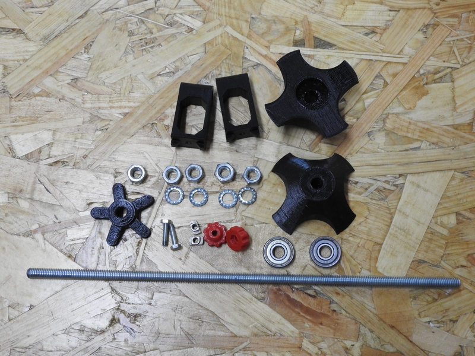
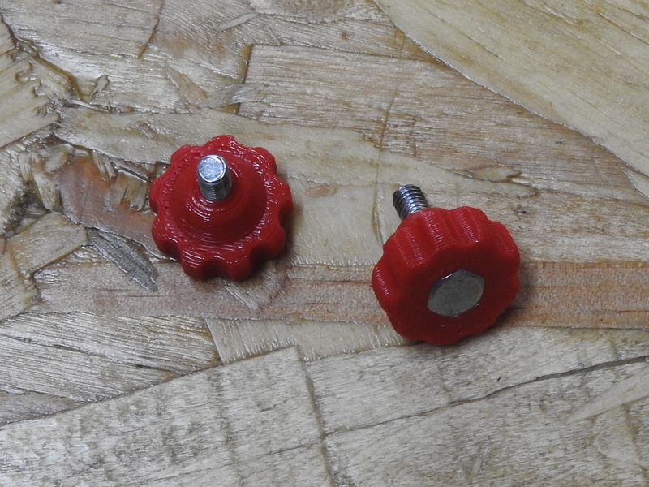
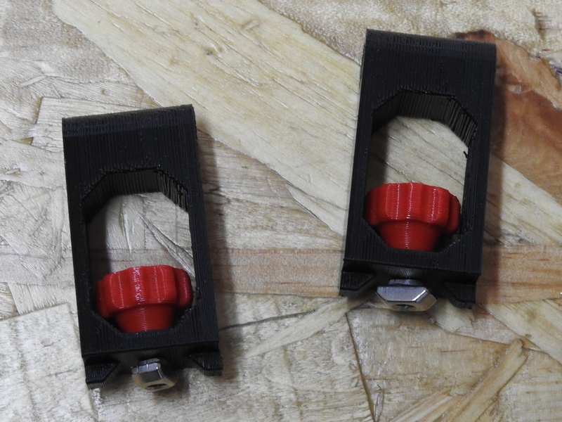
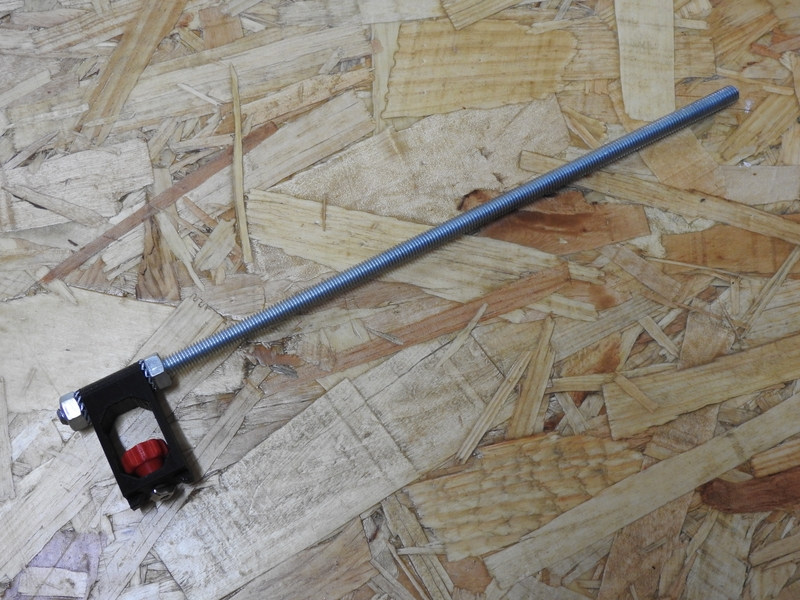
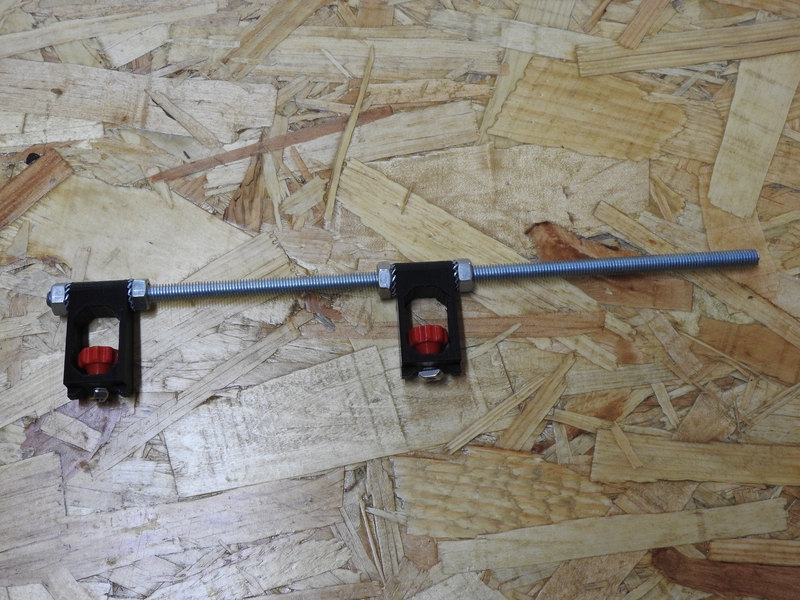
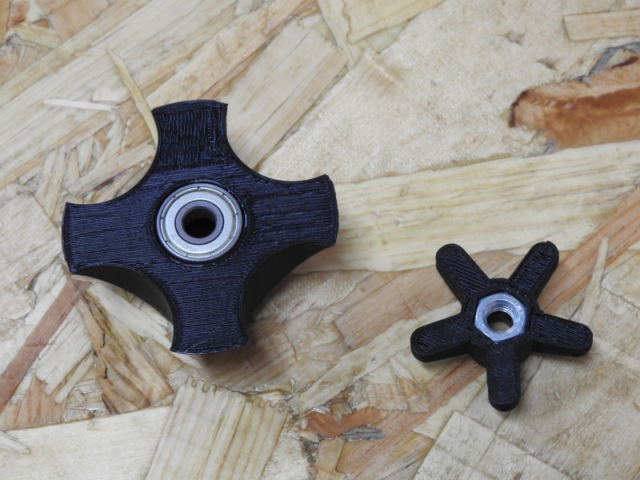
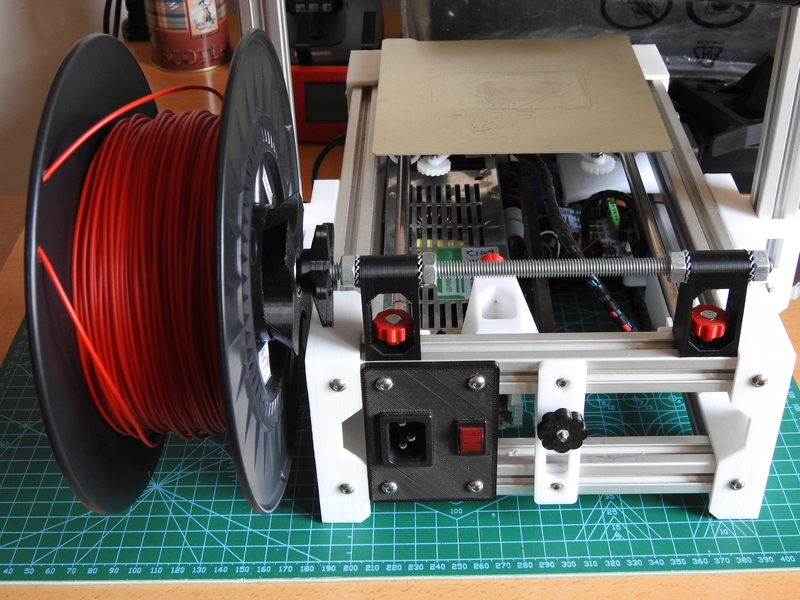
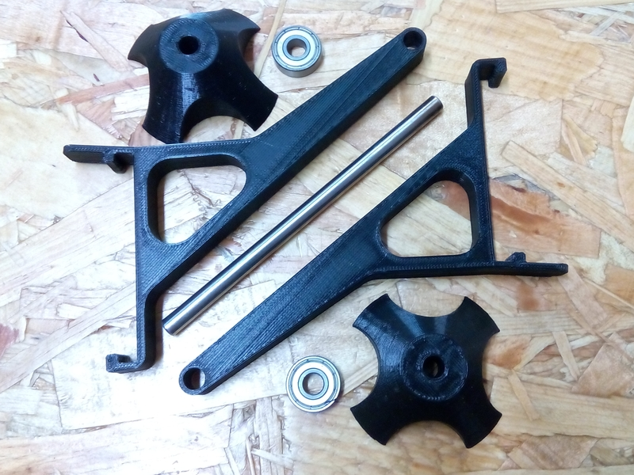
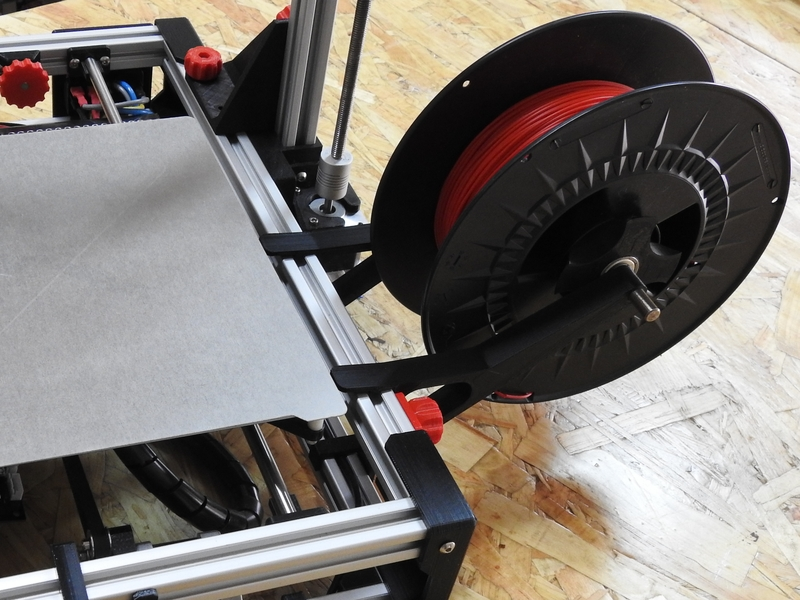
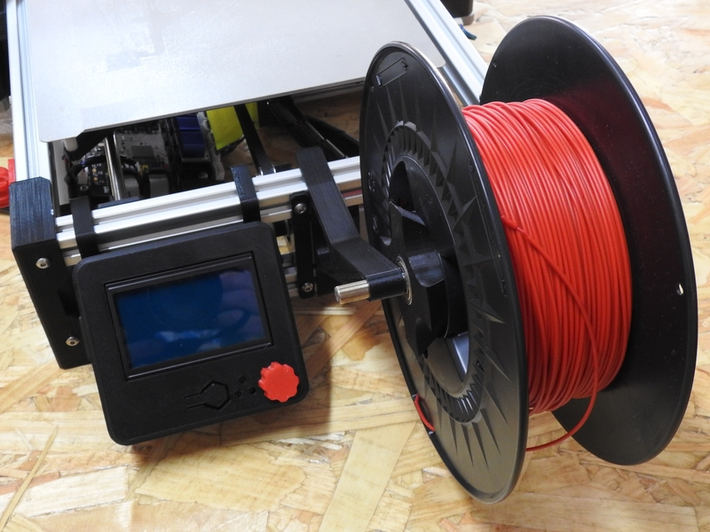

El portabobinas usado en los modelos Foldarap es de 2 tipos: el de brazo roscado y el de brazo liso. Ambos tipos se pueden usar indistintamente en cualquier modelo de impresora. Sin embargo, mientras el modelo de brazo roscado estaría más indicado para bobinas de peso pequeño-medio (de 250gr a 1Kg), el de brazo liso es más adecuado con bobinas medianas-grandes (de 1kg en adelante, hasta 3,3kg). Sea cual sea la elección que se realice, aquí van unas breves instrucciones de montaje.

---
### Modelo de brazo roscado
---

El material necesario para montar un portabobinas de brazo roscado se muestra en la imagen siguiente:

- 2 x piezas impresas **spool-holder-arm-x2** (de la carpeta _stl_ del modelo DDE).
- 2 x piezas impresas **spool-holder-x2**
- 2 x piezas impresas **spool-holder-knob** (en la imagen sólo se ve una).
- 2 x piezas impresas **spool-clamp-knob-x2** 
- 6 x tuercas M8 normales
- 4 x arandelas dentadas M8
- 2 x tornillos M4x16 (preferibles de cabeza hexagonal).
- 2 x tuercas T de métrica M4.
- 2 x rodamientos 608Z.
- 1 x varilla roscada M8 de 30cm de largo.

Empezaremos insertando los tornillos hexagonales en sus correspondientes ruletas, y éstos, en los brazos de apoyo del portabobinas, según se muestra en la secuencia de imágenes.

Con los soportes listos, montamos el brazo portante de la bobina. La separación entre soportes es de 10cm:

Usamos las 2 tuercas M8 que quedan para insertarlas en las ruletas del portabobinas, e insertamos los rodamientos 608Z en los conos de giro (en la foto sólo se muestra una pieza de cada).

¡Y está listo!. La imagen siguiente muestra cómo se instala en la impresora.

---
### Modelo de brazo liso
---

El material empleado para este soporte se muestra en la imagen:

- 2 x piezas impresas **spool-holder-arm-x2** (de la carpeta _stl_ del modelo Super).
- 2 x piezas impresas **spool-holder-x2**
- 2 x rodamientos 608Z.
- 1 x varilla lisa de 8mm de diámetro y del doble de largo que el ancho que la bobina a usar (en este caso es de 15cm).

Puesto que el montaje de este soporte es trivial, sólo se indican un par de formas de colocarlo sobre la máquina.

