## ENSAMBLADO DEL EJE Z

### Material
Para el ensamblado de Eje Z necesitaremos los siguientes materiales:

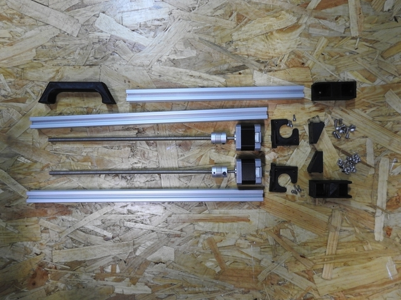

- 1 x Juego de piezas imprimibles para el Eje Z (ver Indice de piezas)
- 2 x varilla roscada M5 ó husillo TR8 (según modelo de impresora a montar)
- 2 x acoplador flexible de 5mm a 5mm, o bien de 5mm a 8mm (según modelo a montar)
- 2 x motor paso a paso (según modelo a montar)
- 6 x tornillo allen M3 de 8mm
- 10 x tornillo allen de 8mm (M3 ó M4 según modelo a montar)
- 2 x tornillo allen de 10 ó 12mm (M3 ó M4 según modelo a montar)
- 12 x tuerca tipo T o normal (según modelo a montar)
- 2 x perfil aluminio Tipo I con ranura de 6mm (longitud según modelo a montar)
- 1 x perfil aluminio Tipo I con ranura de 6mm (longitud según modelo a montar)

---

### Proceso

El primer paso es montar el asa en el perfil transversal del Eje Z.

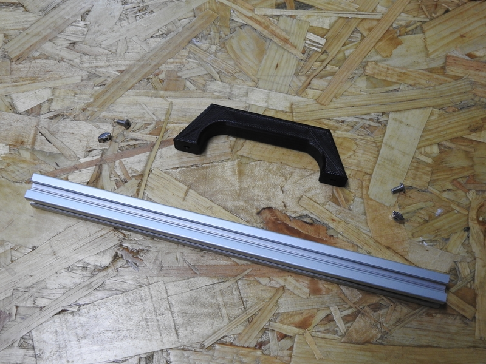

A continuación, montamos los motores con sus piezas en su posición correcta.

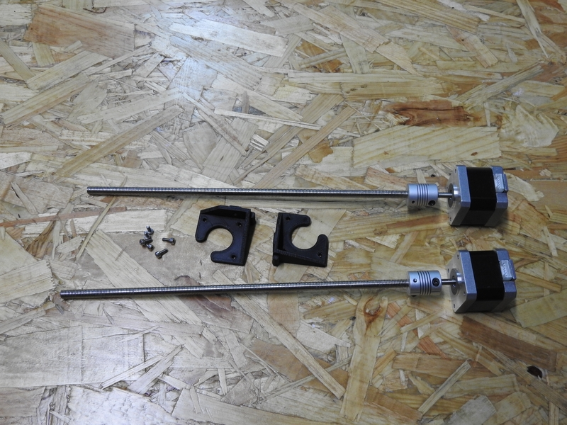

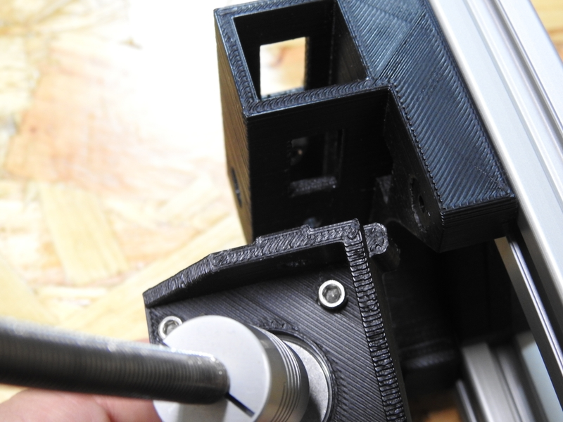

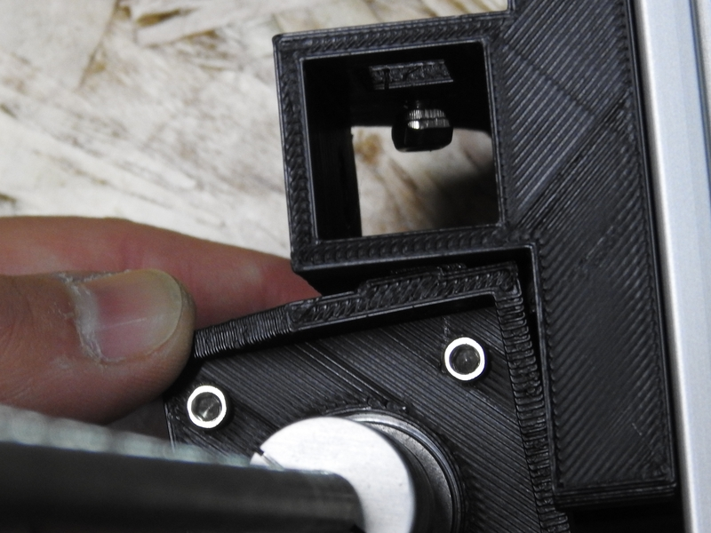

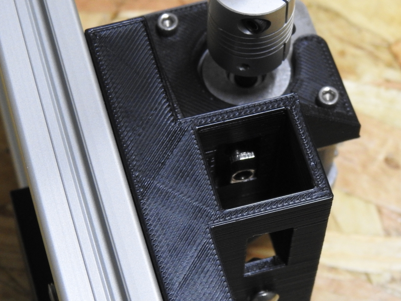

Insertamos un tornillo de 10 ó 12mm para sujetar el perfil firmemente a la pieza de la bisagra y colocamos el perfil a cada lado del Eje Z.

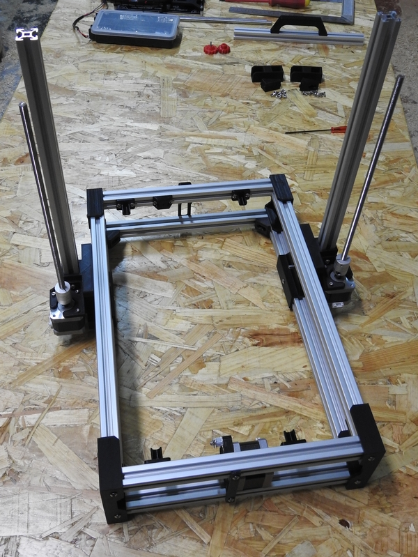

El perfil debe quedar a ras de la parte baja del lugar donde encaja en la bisagra.

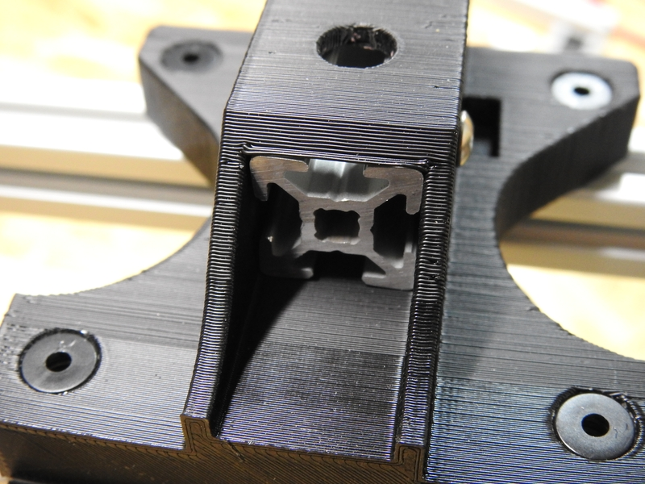

Insertamos el Eje X entre los dos perfiles verticales recién montados.

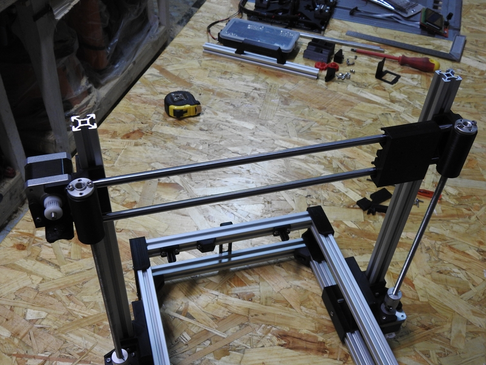

Preparamos las uniones superiores y las montamos para poder colocar el asa.

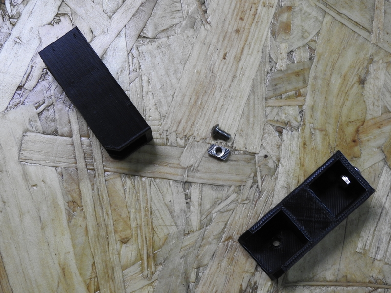

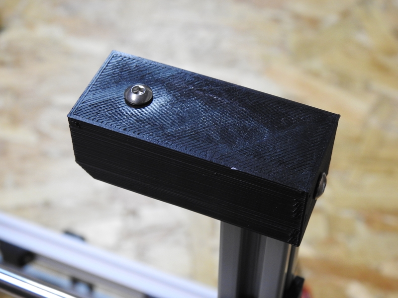

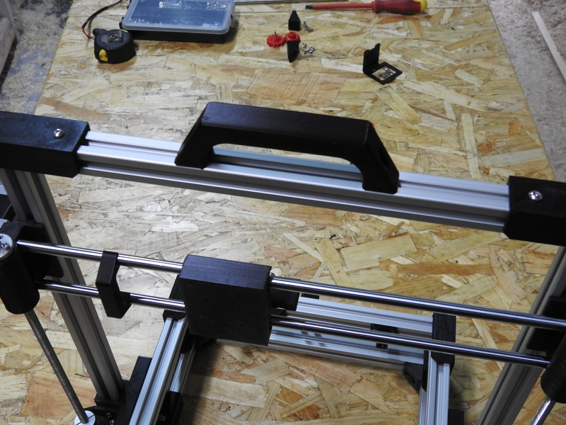

Preparamos los refuerzos de las esquinas interiores y los instalamos a ambos lados del eje Z.

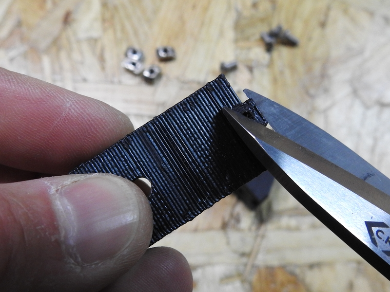

Necesitaremos cortar el saliente de la parte más larga para que encaje bien en el perfil. Estos refuerzos **sólo hacen falta** en la Super Foldarap.

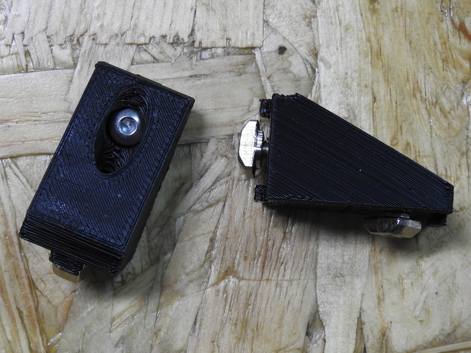

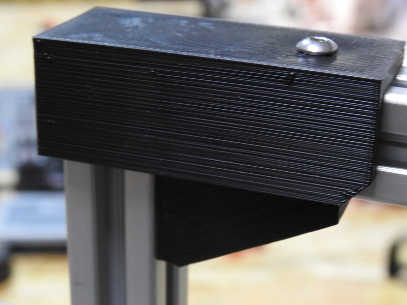

Con todo montado y colocado, la estructura de nuestra impresora plegable debería parecerse a la de la imagen siguiente.

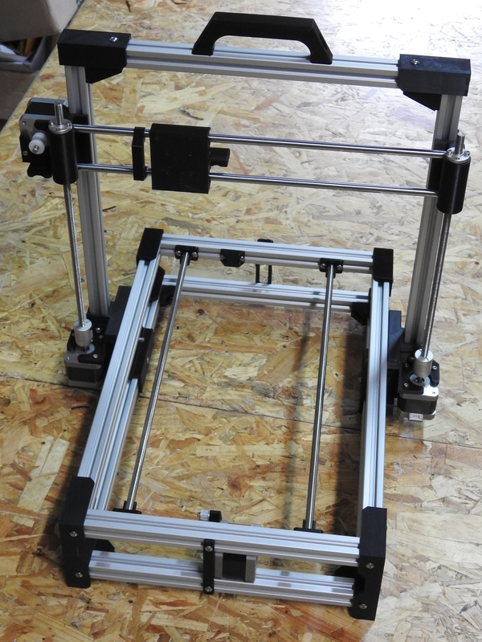
