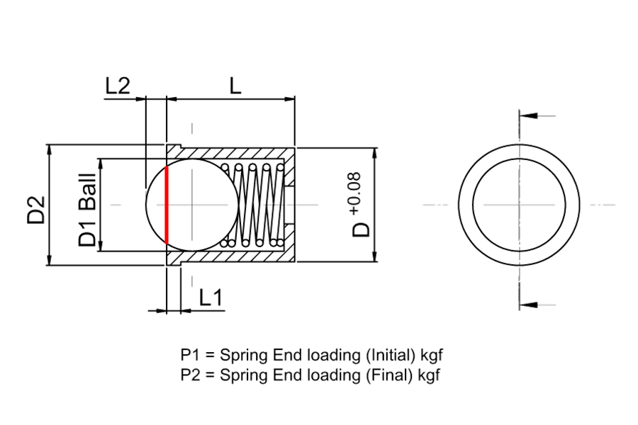

### Indice

- [¿Por qué otra Foldarap?](#q1)
- [¿Qué piezas imprimo?](#q2)
- [¿Cómo puedo personalizar las piezas?](#q3)
- [¿Cuántas copias de cada pieza tengo que imprimir?](#q4)
- [¿Puedo usar cualquier perfil de aluminio?](#q5)
- [¿Cuánto aluminio necesito?](#q6)
- [¿Puedo usar material sobrante de otros proyectos?](#q7)
- [¿Dónde consigo los materiales?](#q8)
- [¿Tiene cama caliente? ¿Tiene sensor inductivo/BLTouch?](#q9)
- [¿Qué tipo de material puedo imprimir con esta impresora?](#q10)
- [¿Cómo es posible que se pliegue?](#q11)
- [¿Dónde puedo seguir los avances del proyecto?](#q12)
- [¿Cómo monto las piezas/impresora?](#q13)
- [¿Cuánto cuesta montar una Foldarap?](#q4)
- [¿Por qué montar una impresora tan cara si hay modelos más asequibles?](#q15)

---

- **¿Por qué otra Foldarap?**

¡¡Porque no!! Si no te gusta --como a mí-- el diseño original de la Foldarap propuesto por su autor [Enmanuel Gillot](https://reprap.org/wiki/FoldaRap), puedes personalizar el tuyo a tu gusto con éste.

- **¿Qué piezas imprimo?**

Las del modelo de impresora que mejor se ajuste a tus necesidades. Tienes 3 modelos de impresora preconfigurados por defecto, de manera que sólo tienes que ver en el apartado de [Información previa](https://github.com/isidorogv/foldarap_escalable/wiki/Informaci%C3%B3n-previa) cuál es el modelo que mejor se ajusta a lo que tu necesitas tener. En la carpeta _/stl_ de cada impresora tienes las piezas .STL listas para usar en tu programa de laminado. Así que sólo tienes que descargar los ficheros .STL adecuados, laminarlos y ¡a imprimir!.

Y si no te gusta ninguno de los tres modelos, modifica las piezas para que se ajusten a tus gustos. Tienes disponibles los ficheros fuente para poder personalizar la impresora en función de lo que necesites.

- **¿Cómo puedo personalizar las piezas?**

Es muy fácil personalizar las piezas, basta con instalar en tu ordenador el programa de diseño [FreeCad](https://www.freecadweb.org/) y modificar los parámetros que se adjuntan en la hoja de cálculo de configuración. 

FreeCad es un programa libre para diseño 3D por ordenador, por lo que se puede descargar e instalar sin cargo económico para tu bolsillo. Además, dispones de su código fuente por si quieres contribuir con alguna modificación al mismo.

Si no quieres usar FreeCad, puedes importar y modificar las piezas en formato .STEP con tu programa de diseño 3D favorito. Estas piezas se incluyen en la carpeta _/step_ de cada modelo de impresora.

- **¿Cuántas copias de cada pieza tengo que imprimir?**

Cada pieza incluye al final de su nombre un sufijo con el número de veces que tienes que imprimirla. Por ejemplo, la pieza _x-motor-holder-x1.stl_ que sujeta el motor del eje X, te indica, mediante el sufijo **-x1**, que debes imprimirla sólo una vez. Sin embargo, la pieza _y-rod-holder-x4.stl_ tendrás que imprimirla 4 veces.

- **¿Puedo usar cualquier perfil de aluminio?**

En principio sí. Sin embargo tienes que tener en cuenta que las piezas que hay en los modelos preconfigurados están hechas para perfil de **20x20 con ranura de 6mm**. Si tu perfil no es de estas características, deberás utilizar los ficheros fuente para personalizar las piezas.

La otra opción sería devolver los perfiles para que te los cambien por los adecuados, si te lo puedes permitir.

Si aún así quieres seguir adelante, necesitarás saber que los ***posicionadores*** elegidos para los modelos ofrecidos, no serán válidos para el tuyo. Los posicionadores son 8 piezas con un muelle y una bola que se encajan en la ranura de los perfiles del Eje Y y ayudan al plegado de la máquina (Eje Z). Cualquier posicionador con una bola de 8mm de diámetro que asome/sobresalga entre 2,6 y 2,7 mm desde el borde del casquillo del posicionador debería servir para un perfil de 6mm de ranura.

Para otras ranuras (5,3mm, 5,5mm, etc...) se puede establecer un cálculo matemático básico basado en el diámetro de la bola y _"lo que asoma"_ desde el borde del casquillo (Ver figura siguiente).

Si en la imagen anterior tenemos que **D1** es el diámetro de la bola y **L2** es "lo que asoma" desde el borde del casquillo, se puede ver que el ancho de la ranura del perfil debe coincidir con la línea roja. Entonces, tomando el centro de la esfera como origen de coordenadas, y aplicando la ecuación de una circunferencia (X^2+Y^2=R^2), podemos encontrar la distancia L2 que haría encajar la bola en el ancho de nuestro perfil sin que el muelle esté comprimido o existan holguras.

- **¿Cuánto aluminio necesito?**

Depende del volumen de impresión que quieras tener en tu máquina. En la [Lista de materiales](https://github.com/isidorogv/foldarap_escalable/wiki/Lista-de-Materiales) de los 3 modelos incluidos en este proyecto se indica la cantidad y el tipo de aluminio que se necesita para montarlos.

Pero si quieres montar una máquina personalizada, lo mejor es calcular la cantidad de perfil en función del volumen de impresión que quieras tener. Sólo hay que tener en cuenta los siguientes puntos:

1. En términos generales, una impresora Foldarap tiene 2 tipos de piezas de aluminio: las piezas **transversales**, que suelen ser las más cortas y van montadas de izquierda a derecha de la máquina; y las piezas **longitudinales**, más largas y que se montan de adelante hacia atrás.

2. La longitud de las piezas transversales son **función del ancho del Eje X**. Por tanto, su distancia se calcula sumando al ancho del Eje X el doble del ancho del perfil que se va a usar, es decir, si necesitas un ancho en el Eje X de 200mm, las 5 piezas transversales de la máquina tendrán una longitud de, al menos, 200+20+20mm suponiendo un perfil de 2020 típico.

3. La longitud de las piezas longitudinales son **función del ancho del Eje Y**. Si nuestro Eje Y es de 200mm de recorrido, se debe emplear piezas longitudinales con, al menos, el doble de distancia que el recorrido del Eje Y, en este caso 400mm.

4. El cálculo del recorrido del Eje Z **es más complejo**, por lo que usar piezas de aluminio de la misma distancia que las piezas transversales calculadas para el Eje Y es una buena aproximación. Dependerá de lo alto que esté la cama y el fusor que se pueda abarcar el mismo recorrido que en el Eje Y con la misma longitud de piezas.

Como ejemplo, si se quiere montar una máquina con un volumen de impresión de 200x300x200, se necesitarán 5 tramos de 200+20+20 (240mm) y 6 tramos de 2*300 (600mm), lo que hace un total de 5*240+6*600=4800mm (casi 5m de aluminio 2020).

Pero se puede considerar la posibilidad de cambiar las dimensiones de los ejes de la siguiente forma: 300x200x200. De esta manera el aluminio necesario sería: 5*(300+20+20)+6*(2*200)=4100mm, lo que se traduce en un ahorro de aluminio que nos dejaría un poco de dinero más para otras cosas, al mismo tiempo que aligera el peso de la máquina.

- **¿Puedo usar material sobrante de otros proyectos?**

Sí, pero es posible que tengas que personalizar algunas piezas dependiendo del material reciclado que vayas a usar. Y puesto que los ficheros fuente de las piezas están disponibles, no resultará difícil.

- **¿Dónde consigo los materiales?**

En el apartado de [Lista de materiales](https://github.com/isidorogv/foldarap_escalable/wiki/Lista-de-Materiales) se indica dónde conseguir algunos de los materiales que resultan más complicado encontrar. Materiales simples como los tornillos y tuercas, por ejemplo, se pueden conseguir en la ferretería de tu localidad. 

En el Apéndice [Presupuesto](https://github.com/isidorogv/foldarap_escalable/wiki/presupuesto) se dan precios y lugares de compra de referencia. No dejes de consultar esa información.

No obstante, consulta [este doumento en línea](https://docs.google.com/spreadsheets/d/1X_YadjlI8vMMyHm6OJC0m9nL4FwHvPIohqj0Lg3HOV8/edit#gid=1922757665) para tener una mejor idea sobre el tema de los suministros.

- **¿Tiene cama caliente?¿Tiene sensor inductivo/BLTouch?**

Depende del modelo. Por defecto, sólo la Foldarap de tamaño medio, y la Super Foldarap usan cama caliente. El modelo pequeño no la usa pero se le puede incluir como mejora.

En cuanto al sensor de altura en el Eje Z, también se incluye de serie en los modelos Super Foldarap y Foldarap, pero no en la MiniFolda. Esto es debido al pequeño tamaño (superficie)  de su bandeja de impresión. Al ser tan pequeña no es necesario un sensor de ese tipo, pero se puede incluir como personalización.

- **¿Qué tipo de material puedo imprimir con esta impresora?**

Depende del tipo de impresora que hayas montado y del extrusor/fusor que vayas a instalar. El PLA se puede imprimir con cualquier impresora del mercado, incluso en cama fría. El ABS es más complicado de imprimir, ya que requiere cierto conocimiento de las técnicas de impresión. Además necesita obligatoriamente cama caliente. El resto de materiales dependerá de tus conocimientos y el fusor que hayas montado.

- **¿Cómo es posible que se pliegue?**

El plegado de la impresora se debe a la acción de un par de bisagras que, junto con un par de juegos de posicionadores de bola, permiten con un giro de 90º, colocar el eje Z de la máquina en horizontal o vertical sin apenas esfuerzo.

- **¿Dónde puedo seguir los avances del proyecto?**

En el repositorio se pueden ver las actualizaciones que se suben para corregir errores en las piezas o diseño de la impresora. Y si quieres segir los avances de cerca, participar en los debates sobre mejoras, consultar problemas que te hayan surgido, busca el canal de Telegram _"Foldarap Escalable"_ (sin las comillas).

- **¿Cómo monto las piezas/impresora?**

En el apartado de Ensamblado de este Wiki hay instrucciones genéricas para montar cualquiera de los 3 modelos de impresora que figuran en el repositorio. Sigue las indicaciones y si te atascas... ¡pregúntanos en el grupo de [Telegram](https://t.me/scalable_foldarap)!

- **¿Cuánto cuesta montar una Foldarap?**

El precio de la Foldarap depende mucho de los materiales que quieras emplear en ella. No es lo mismo utilizar piezas originales en el extrusor, fusor o electrónica de control, por ejemplo, que usar imitaciones. El hecho de usar imitaciones no implica necesariamente que la calidad de las impresiones hechas con esta impresora sea menor que las relizadas con los originales, pues todo dependerá del tiempo que se dedique a su calibrado fino y a su mantenimiento.

El Apéndice [Presupuesto](https://github.com/isidorogv/foldarap_escalable/wiki/Presupuesto) ofrece un desglose de la factura de montaje de una impresora Foldarap. A modo de resumen, se estima que el coste del material para una impresora como ésta oscilará entre los 300 y 500 Euros.

- **¿Por qué montar una impresora como ésta si hay otros modelos más baratos ya montados?**

¡¡Muy buena pregunta!!. Si lo que quieres conseguir con tu impresora es, simplemente, enchufarla e imprimir, la mejor opción es sin duda alguna, adquirir una ya montada y probada. Modelos como la ___Ender 3___, la ___CR-10___ o la ___Artillery X1___, por nombrar unas pocas, ofrecen la posibilidad de obtener resultados de impresión muy buenos con un desembolso económico aceptable. Son máquinas hechas para que el usuario apenas tenga que preocuparse por su mantenimiento/montaje y pueda centrarse desde el principio en lo que realmente le interesa: ___¡imprimir!___

En el otro extremo se encuentran las impresoras que, como la Foldarap, no sólo te permiten imprimir (¡¡estaría bueno!!), si no también aprender los fundamentos en los que se basa un dispositivo como éstos. Saber cómo funciona una impresora 3D, saber en qué principios se basan sus mecanismos, te permite adquirir un conocimiento que te habilita para poder montar una impresora con el material disponible que tengas a tu alrededor. También te permite un análisis rápido y certero en muchas ocasiones, de los problemas que pueden surgir durante la operación de una máquina como ésta y cómo te pueden arruinar una impresión que estaba quedando muy bien. Montar una impresora pieza a pieza es una experiencia tremendamente formativa y enriquecedora, que también tiene sus inconvenientes, por supuesto, como son el esfuerzo que conlleva aprender conceptos nuevos y el tiempo que hay que dedicarle.

Dependerá de tu perfil Maker decidirte por una opción u otra. La postura del autor de este sitio es que, a pesar de todo lo dicho anteriormente, se recomienda a todo usuario que desee profundizar en el campo de las impresoras 3D, que se lance a montar una impresora desde cero. Si se decide por ello, aquí hay un buen modelo para empezar.

¡Que lo impruses bien!

[Subir](#top)