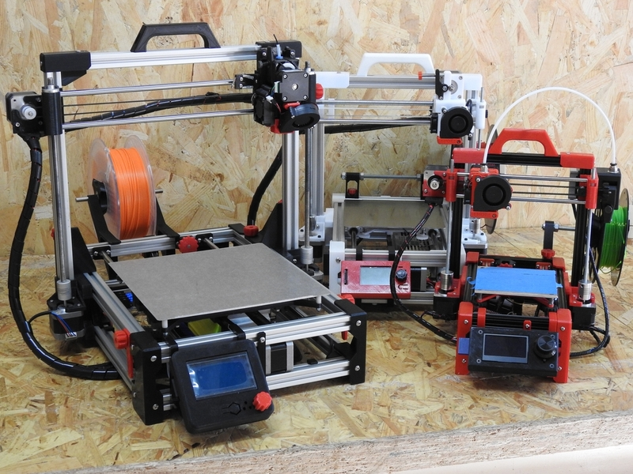

Este wiki es una fuente de consulta sobre la impresora 3D ***Foldarap Escalable***. La *Foldarap Escalable* es una versión modificada de la versión 1.0 de la impresora _Foldarap_ relizada por [Enmanuel Gillot](https://github.com/EmmanuelG/Foldarap). La principal diferencia respecto de la impresora orginal es que, en este caso, las piezas están parametrizadas, de manera que se puede personalizar el tamaño de la impresora según las necesidades del usuario.

Para poder hacer esta personalización, se sumistran los ficheros fuente en formato freecad ***.fcstd***, que pueden ser abiertos y editados con el programa libre [FreeCad](https://www.freecadweb.org/).

En los ficheros fuente se incluirán los parámetros variables que permitirán modificar el tamaño de la impresora en función del tamaño del perfil de aluminio usado, el espacio que se necesita para albergar la electrónica y la fuente de alimentación bajo el eje Y, el tamaño de los motores (NEMA14 ó NEMA17), etc...

Es imprescindible, por tanto, tener instalado el programa [FreeCad](https://www.freecadweb.org/) si se desea modificar las piezas a medida a partir de los ficheros ***.fcstd***. Si no dispones de Freecad, pero usas otro tipo de editor CAD, puedes emplear los ficheros ***.step*** suministrados para realizar las modificaciones a partir de ellos.

Si a pesar de todo esto, sólo estás interesado en replicar alguno de los modelos de impresora mostrados en esta wiki, existen modelos básicos de la impresora (como los de la foto adjunta de arriba) que no precisan ninguno de los programas mencionados para poder ensamblar una impresora. Estos modelos básicos o ***presets***, disponen de ficheros en formato **.stl** que permiten imprimir directamente las piezas sin tener que especificar nada. Por contra, sólo permitirían montar una impresora idéntica a la que se indica en sus instrucciones de montaje correspondientes (ver [wiki](https://github.com/isidorogv/foldarap_escalable/wiki) de ensamblado).

