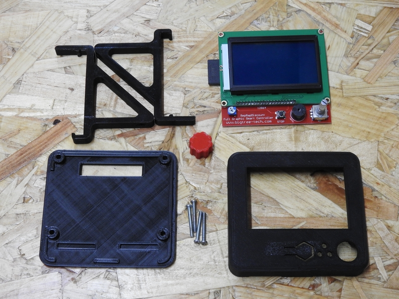
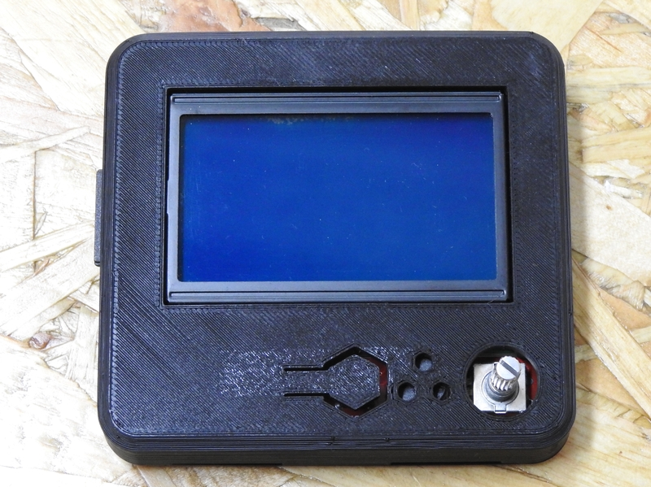
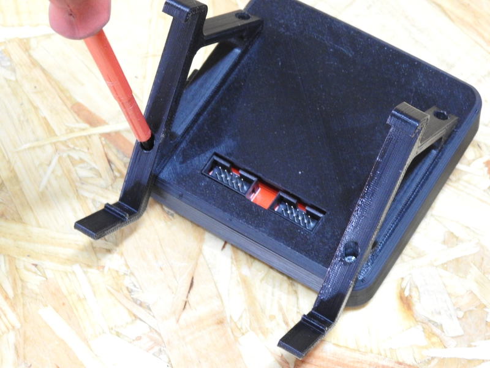
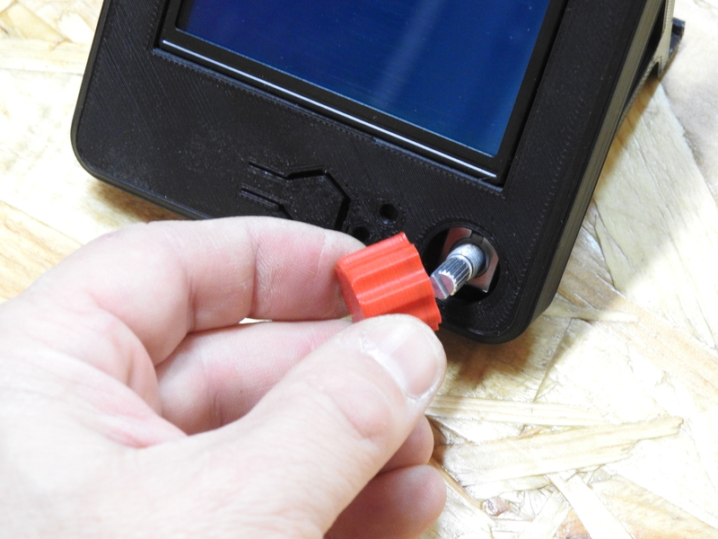
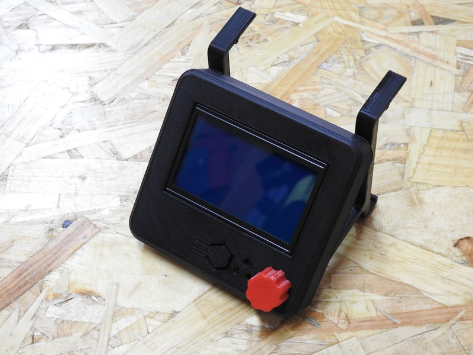
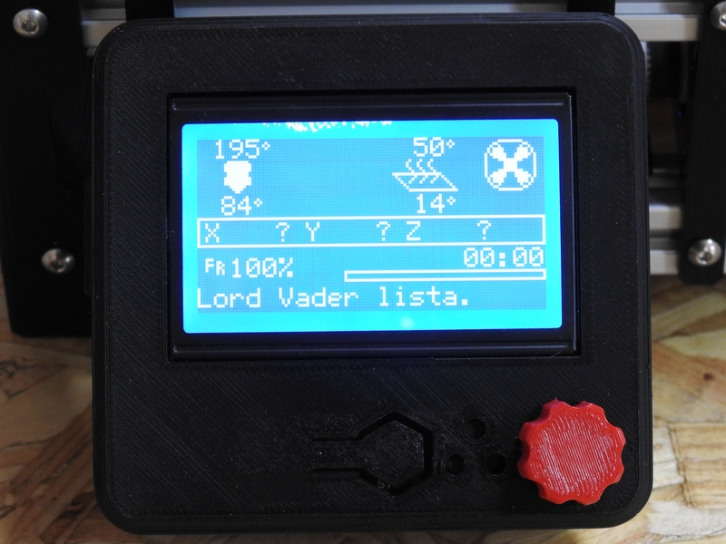

Esta es una de las partes opcionales de la impresora, ya que es posible que no necesites instalársela. Por ejemplo, si va a formar parte de una red de impresoras, es muy probable que prefieras usar un programa como [Octoprint](https://octoprint.org/) para gestionar todas tus impresoras de forma centralizada, en lugar de hacerlo de forma individual.

En cualquier caso, si te decides a instalar una pantalla LCD para controlar de forma local tu impresora, aquí tienes la secuencia de pasos a seguir. En las imágenes sólo se muestra el montaje de la pantalla _LCD Full Graphics 12864_ del modelo Super Foldarap. Para otras pantallas el proceso es similar. En el repositorio de piezas se incluyen cajas y soportes para pantallas **Mini MKS 12864, FYSETC mini 12864 y LCD Full Graphics 12864**. Si tu LCD no está entre estos modelos, visita el portal [Thingiverse](https://www.thingiverse.com/) para encontrar un modelo para la tuya:

- 1 x Tapa de LCD.
- 1 x Trasera de LCD.
- 2 x soportes para perfil de aluminio.
- 1 x pantalla LCD.
- 4 x tornillos M3x25mm (también valen de 30mm).

